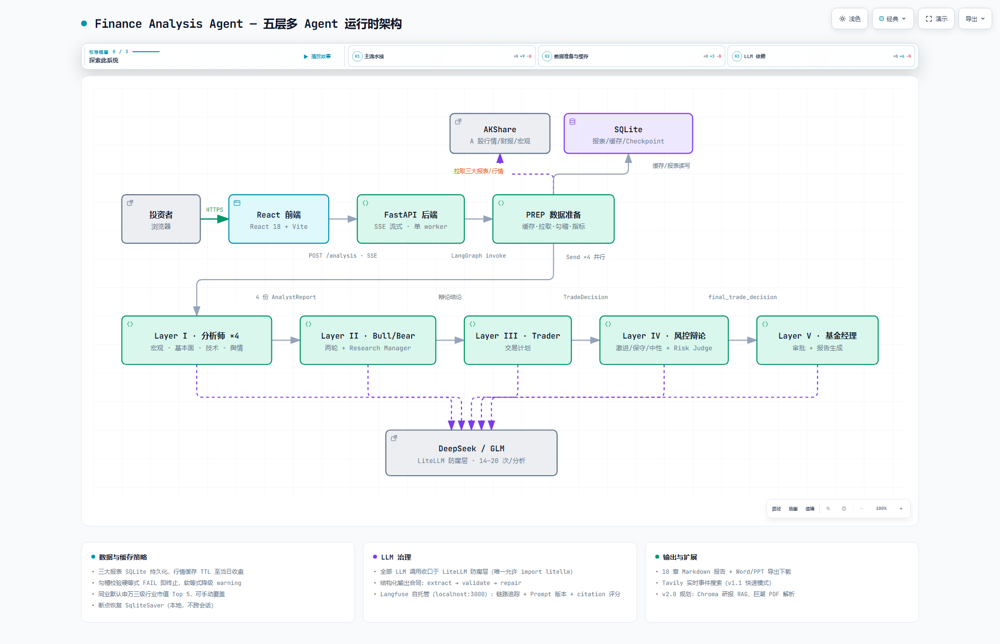
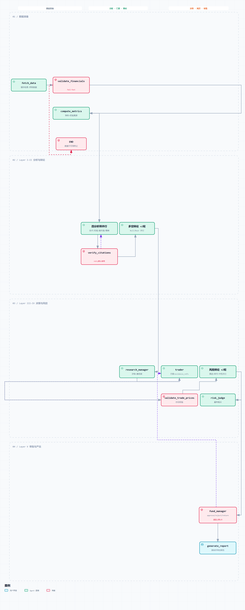

# Finance Analysis Agent

基于 LangGraph 的 A 股上市公司 AI 分析报告系统。输入股票代码或自然语言查询，通过多 Agent 辩论式架构自动生成交易决策分析报告。支持深度分析、快速搜索、追问三种模式，标的不明确时 Agent 主动反问澄清；SSE 流式实时推送分析进度，交易决策自动落库并按交易日收盘结算。

## 架构

<a href="docs/assets/architecture-overview.html">
  <picture>
    <source media="(prefers-color-scheme: dark)" srcset="docs/assets/architecture-overview.dark.png">
    
  </picture>
</a>

> 运行时架构图由 [Archify](https://github.com/tt-a1i/archify) 生成（图源 [architecture-overview.json](docs/assets/architecture-overview.json)）；克隆仓库后本地打开 [architecture-overview.html](docs/assets/architecture-overview.html) 可交互浏览（缩放、搜索、明暗主题、导览路径）。
> 图拓扑由 build_5layer_graph() 生成，Mermaid 源码见 [graph.mmd](docs/assets/graph.mmd)

五层架构：

| 层级     | 选型            | 职责                                                              |
| -------- | --------------- | ----------------------------------------------------------------- |
| L1 前端  | React 18 + Vite | 自然语言输入 + SSE 流式渲染 + 报告展示 + 文件下载 + 会话管理      |
| L2 Agent | LangGraph + ReAct Harness | 5 层架构 + 多 Agent 辩论 + Send 并行派发 + 三模式编排     |
| L3 数据  | pandas + SQLite | AKShare 拉取 + 指标计算 + K 线/宏观/新闻 + 报表持久化 + 行情缓存  |
| L4 LLM   | LLM Provider Gateway | ProfileResolver 唯一解析入口 + 能力探测门禁 + LiteLLM 收口适配（默认 opencode zen 网关 deepseek-v4-flash） |
| 可观测性 | Langfuse        | LLM 调用链路追踪 + Prompt 版本管理 + 引用校验评分                 |

> L2 Agent 5 层：4 分析师并行 -> Bull/Bear 辩论 -> Trader -> Risk Management 辩论 -> Fund Manager（详见 [ADR-0011](docs/adr/0011-five-layer-architecture.md)）

节点级完整链路（LangGraph，14 节点 / 16 边）：

<a href="docs/assets/pipeline-workflow.html">
  <picture>
    <source media="(prefers-color-scheme: dark)" srcset="docs/assets/pipeline-workflow.dark.png">
    
  </picture>
</a>

> 链路图由 [Archify](https://github.com/tt-a1i/archify) 生成（图源 [pipeline-workflow.json](docs/assets/pipeline-workflow.json)），按泳道分组（数据准备 / Layer I–II 分析与辩论 / Layer III–IV 决策与风控 / Layer V 审批与产出）：fetch_data → validate_financials → compute_metrics → 四分析师并行 → verify_citations → 多空辩论×2 轮 → research_manager → trader → validate_trade_prices → 风控辩论×2 轮 → risk_judge → fund_manager → generate_report → END；克隆仓库后本地打开 [pipeline-workflow.html](docs/assets/pipeline-workflow.html) 可交互浏览。

## 功能特性

- **三模式设计**：深度分析（5 层完整管线 -> 10 章报告）/ 快速搜索（Tavily Web 搜索，精简回答）/ 追问（基于已有报告的上下文问答）；标的不明确时 Agent 反问澄清（ADR-0017）
- **自然语言输入**：支持股票名称（"宁德时代"）、代码（"300750"）或自然语言指令（"分析茅台"），AKShare 模糊匹配自动解析
- **SSE 流式推送**：分析进度实时推送，前端渐进渲染——分层管线时间轴（节点状态/耗时/ETA 预估）、思考过程摘要、工具调用与搜索横幅
- **会话管理**：侧边栏新建/切换/搜索/重命名/删除会话，后端 SQLite 持久化；刷新或切换会话后流式断点续传
- **引用校验与展示**：Claim 6 类分类法 + computational 公式重算 + 术语/期次一致性校验，检测 LLM 幻觉（见 [citation.py](src/finance_agent/citation.py)）；前端行内引用上标 + hover 预览卡（校验状态三态配色）
- **报告导出与下载中心**：Markdown 渲染 + ECharts 交互图表 + Word/PPT/PDF 导出；`/downloads` 独立页集中管理导出文件（类型筛选/搜索/增量加载）
- **决策结果跟踪**：交易决策自动落库（价位申报必填——Trader 方案缺失 entry/stop/target 数值时校验打回重报），工作日收盘后日批结算（止损/目标/超期规则），APScheduler 进程内调度
- **LLM 设置面板**：多 profile 管理 + 模型能力探测门禁（tool_call/json_output/stream 不满足时禁用对应模式入口并提示原因）
- **深色模式与效率操作**：浅色/深色/跟随系统三态主题，Cmd/Ctrl+K 命令面板（会话搜索 + 快捷动作），全局快捷键（新建会话/折叠侧边栏/聚焦输入）
- **Langfuse 可观测性**：LLM 调用链路追踪、Prompt 版本管理、引用校验评分上报

## 质量保障

- 后端 229 个 pytest 测试文件（2,319 个用例，含 `tests/llm_contracts/` provider 合同套件）、前端 74 个 Vitest 测试文件（581 个用例）、28 个 Playwright E2E spec / 64 个用例（stub 套件为 CI 门禁，`@live` 真模型套件 nightly 防漂移）
- `evals/` 评估框架（详见下节「评估体系」）：judge 评分与人工校准 / 版本对比 / 消融实验 / claim 验证基准 / golden set / 决策回放显著性检验

## 评估体系

为多 Agent 决策系统建立的四层评估体系，覆盖「校验器自身可信度 → 产出质量 → 决策回放 → 架构归因」：

### 1. 校验器自评估层（确定性命中的准度门禁）

- **对抗基准集**：`evals/claim_benchmark/data/benchmark_v12.jsonl`（81 条，构造即标签、免 LLM 标注）——含容差边界近失配（±{0.3,0.5,0.7,1}% 四档）、语义错位对抗子集、v3 新校验路径样本（取整感知容差 / comparative 双端）
- **CI 回归门禁**（`ci.yml`）：F1 ≥ 0.90 且相对冻结基线退步 > 0.02 即阻断合并；注入式故障演练验证（容差 0.5%→5% → F1 1.0→0.58、exit 1、还原全绿）
- **golden set v1.0**（13 条，已冻结）：assertion 级 deterministic 判定（拒答声明 / 合规红线 / 事故回归 claim 对照），零 token 进 CI（`evals/golden/gates.py`）
- 校准故事：61% 契约病误诊 → 分桶归因 → 修复四类契约 → 三标的 FAIL 3.5%/0%/0%

### 2. 产出质量层（LLM 实验回归）

- Langfuse 实验追踪 + `evals/compare.py` 配对 bootstrap（B=10,000）显著性门禁（CI 含 0 只写「无显著差异」）
- judge 评分体系（relevance/debate_quality/decision_grounding/consistency）+ 跨模型校准（含评分者漂移披露）；**人工校准闭环**——round5 未达标 → 材料/rubric 多轮修复 → round7 盲标 41 对全维度达标（MAE 0.342 / 方向一致率 97.6%）→ round8 维护者代裁审计无虚高（MAE 0.122 / 方向 100%），judge 判可用

### 3. 决策回测层（防前视偏差的历史回放）

- `evals/backtest/`：数据时点截断（财报按披露截止日）、分层市场状态抽样、与规则基线（Buy-and-Hold/MACD/KDJ/RSI）对比、block bootstrap 置信区间
- 基线按系统持有窗口切片（horizon 对齐）；空 K 线显式报错防静默污染

### 4. 架构归因层（数据对齐消融）

- `evals/ablation.py`：三变体（analysts / +辩论 / 完整五层）× 同 state 快照 × 配对 bootstrap；n=10 权威版 90 run（1,788 次调用 / 1,260 万 token）——辩论层与完整层的 judge 维度增量 95% CI 全含 0，即**在 3 标的、有效 n=3、judge 未校准的条件下未获统计支持**（见 [消融 n10 权威结果](docs/evals/2026-09-03-消融n10权威结果.md)；该报告的有效 n 与适用口径以其「适用口径披露」为准）
- **成本梯度（n10 实测，相对上一层）**：辩论层 +7.9%、决策+风控层 +30.1%；相对 analysts 整体 +40.3%（裁到 analysts 省 28.7%）
- **是否裁剪管线：未决**。「增量价值未获统计支持」与「无价值」是两个命题——有效 n=3 的分辨率不足以支持裁剪决策，需等 v2 消融（因果主张登记 + 注入法 + 单元级判定）裁决
- judge 维度按变体适用性过滤（避免评「不存在的层」）由 `_applicable_dims` 承担，**库侧已生效**；n10 批次（2026-09-03）跑在其落地之前，故该批次的 plus_debate 行含 grounding/consistency 伪影分（报告已标注，勿引用）

> **诚实边界**：消融/回测为通路验证级初步证据（3 标的 × 10 重复；层增量的配对单元是标的，有效 n=3）；pilot 的「完整层 decision_grounding 显著退步」在修复评估缺陷（#111/#112）后证实为评估伪影，其报告已标 `superseded`；n10 权威批次自身仍带两处未披露过的缺陷——#112 伪影存活（plus_debate 的 grounding/consistency）与 judge 未校准（跑批早于 round7 达标 10 天）——已在其报告中补披露；确定性指标（citation_pass/coverage/门禁）全程可信。基线说明见 [docs/evals/](docs/evals/)。

## 快速开始

### 方式一：Docker 一键部署（推荐）

**环境要求**：Docker Desktop

```bash
# 配置环境变量
cp .env.example .env
# 编辑 .env 填入 LLM_API_KEY（必填）

# 一键启动全部服务（前端 + 后端 + Langfuse 可观测性）
docker compose up -d --build
```

启动后访问：

| 服务 | 地址 | 说明 |
|------|------|------|
| 前端 | http://localhost:5173 | React 应用 |
| API 文档 | http://localhost:8000/docs | FastAPI Swagger |
| Langfuse | http://localhost:3000 | LLM 调用追踪（首次需注册） |

```bash
# 常用命令
docker compose down              # 停止（保留数据）
docker compose down -v           # 停止 + 清空数据
docker compose logs -f backend   # 查看后端日志
docker compose ps                # 服务状态
```

### 方式二：前后端分离开发

**环境要求**：Python >= 3.12, uv, Node.js >= 18

```bash
# 后端（FastAPI，端口 8000）
uv sync
uv run uvicorn finance_agent.api:app --host 127.0.0.1 --port 8000 --reload

# 前端（Vite，端口 5173，另开终端）
cd frontend
npm install
npm run dev
```

## 环境变量配置

首次运行前需要配置 LLM API Key，否则会报错。

```bash
# 复制模板并填入你的 API Key
cp .env.example .env
```

### 变量一览

| 变量 | 必填 | 默认值 | 说明 |
|------|------|--------|------|
| `LLM_API_KEY` | **是** | - | LLM API Key；也可用 `DEEPSEEK_API_KEY` 作为回退 |
| `LLM_MODEL` | 否 | `openai/deepseek-v4-flash` | 深度模式模型名，litellm 格式 |
| `LLM_QUICK_MODEL` | 否 | `openai/deepseek-v4-flash` | 快速/追问模式模型名 |
| `LLM_BASE_URL` | **条件必填** | -（无代码默认，见 `.env.example` 模板值） | API 端点。**与 `LLM_API_KEY` 搭配使用时必填**——配了 key 缺端点启动即报 `IncompleteLLMConfigError`（有意收紧，见 5.1-B2）；只配 `LLM_MODEL` 不配 key 时按模型前缀走官方端点，可省略 |
| `LLM_THINKING` | 否 | `enabled` | 思考模式 `enabled` / `disabled` |
| `LLM_REASONING_EFFORT` | 否 | `max` | 思考强度 `low` / `high` / `max` |
| `TAVILY_API_KEY` | 否 | - | Tavily 搜索 API Key，快速模式 Web 搜索需要 |
| `REPORTS_DIR` | 否 | `reports` | 报告输出目录 |
| `EVENT_SOURCE` | 否 | `auto` | 事件数据源 `builtin` / `web` / `auto` |
| `LANGFUSE_PUBLIC_KEY` | 否 | - | Langfuse 公钥，配置后启用 LLM 调用追踪 |
| `LANGFUSE_SECRET_KEY` | 否 | - | Langfuse 密钥 |
| `LANGFUSE_HOST` | 否 | `https://cloud.langfuse.com` | Langfuse 服务地址（自托管填本地地址） |
| `LLM_DROP_PARAMS_STRICT` | 否 | 未设置 | 应急回滚开关（仅运维）：`=1` 恢复「全局静默丢弃不支持参数」的旧行为。**必须在首次 LLM 调用前设置**——该开关只在 adapter 首次初始化时读取（`ensure_litellm_runtime`），进程起来后再设不生效；默认行为是白名单显式剔除 + trace warning，关键参数不支持时显式报错 |

### 示例

**默认配置（opencode zen/go 网关 + deepseek-v4-flash）**：

```bash
# .env
LLM_API_KEY=sk-xxxxxxxxxxxxxxxx
```

**直连 DeepSeek**：

```bash
# .env
LLM_API_KEY=sk-xxxxxxxxxxxxxxxx
LLM_MODEL=deepseek/deepseek-v4-pro
LLM_BASE_URL=https://api.deepseek.com
```

**使用其他 OpenAI 兼容服务（通过 litellm 格式）**：

```bash
# .env
LLM_API_KEY=sk-xxxxxxxxxxxxxxxx
LLM_MODEL=openai/gpt-4o
LLM_BASE_URL=https://api.openai.com/v1
```

## 项目结构

```
src/finance_agent/
├── api.py                # FastAPI 应用 (SSE 流式接口 + 会话管理)
├── graph.py              # LangGraph 主图 (build_5layer_graph)
├── state.py              # AnalysisState TypedDict (含 Annotated reducers)
├── models.py             # 结构化输出模型 (AnalystReport/DebateMessage/TradeDecision)
├── routing.py            # 路由函数 + Send 并行派发
├── react_agent.py        # ReAct Agent (三模式编排入口)
├── agent_factory.py      # Agent 工厂 (按模式创建工具集 + system prompt)
├── pipeline_runner.py    # 5 层管线运行器 (独立线程 + 进度快照持久化)
├── session_store.py      # 会话持久化 (SQLite, WAL 模式)
├── stream_registry.py    # per-session 生成任务与订阅者管理
├── citation.py           # 确定性引用校验器 (Claim/CitationReport/verify_claims)
├── citation_coverage.py  # 正文数字普查 (citation recall 的确定性近似)
├── metric_vocab.py       # 指标词表 + 期次/数值归一化 (术语一致性校验)
├── app_search.py         # 股票搜索（模糊匹配）
├── web_search.py         # Tavily Web 搜索封装
├── charts.py             # 图表数据收集 + matplotlib PNG 生成
├── timeline_builder.py   # 流式时间线构建
├── langfuse_tracing.py   # Langfuse 追踪集成
├── llm/                  # LLM Provider Gateway（防腐层）
│   ├── resolver.py       # ProfileResolver：配置唯一解析入口 (请求级→preset→环境变量)
│   ├── router.py         # PolicyRouter：按用途能力过滤 + fallback 链
│   ├── probes.py         # 模型能力探测 (tool_call/json_output/stream 等)
│   ├── contracts.py      # 结构化输出合同 (extract → validate → repair)
│   ├── registry.py       # provider 静态能力表
│   └── adapters/litellm_adapter.py  # 唯一允许 import litellm 的位置
├── nodes/                # 图节点
│   ├── cache.py          # check_cache
│   ├── fetch.py          # fetch_data
│   ├── validate.py       # validate_financials (勾稽校验)
│   ├── compute.py        # compute_metrics (含技术指标 + 风控)
│   ├── analysts.py       # Layer I: 4 个分析师
│   ├── debate.py         # Layer II: bull/bear debater
│   ├── research_manager.py # Layer II: research_manager
│   ├── trader.py         # Layer III: trader
│   ├── risk.py           # Layer IV: 3 debaters + risk_judge
│   ├── fund_manager.py   # Layer V: fund_manager
│   ├── citation_node.py  # 引用校验节点 (分桶聚合 + 定向重试)
│   ├── report.py         # 5 层报告生成
│   ├── output.py         # generate_file (Word/PPT/PDF/Markdown)
│   ├── _llm_utils.py     # 共享 LLM 工具 (parse_json_response)
│   └── _timing.py        # 节点耗时追踪
├── harness/              # ReAct Agent Harness (工具循环引擎)
│   ├── loop.py           # Agent 主循环 (think -> act -> observe)
│   ├── llm_client.py     # LLM 客户端接口
│   ├── litellm_client.py # LiteLLM 实现 (经 gateway 收口)
│   ├── stub_llm_client.py # 测试用 stub
│   ├── tool_manager.py   # 工具注册与调度
│   ├── context.py        # Agent 上下文管理
│   ├── hooks.py          # 生命周期钩子 (流式事件推送)
│   ├── permissions.py    # 工具权限控制
│   └── types.py          # Harness 类型定义
├── metrics/              # 指标计算（纯函数）
│   ├── validate.py       # 勾稽校验 4 规则
│   ├── solvency.py       # 偿债 5 指标
│   ├── profitability.py  # 盈利 5 指标
│   ├── efficiency.py     # 运营 4 指标
│   ├── cashflow.py       # 现金流 6 指标
│   ├── dupont.py         # 杜邦 3 层分解
│   ├── traffic_light.py  # 红黄绿灯 + 健康度评分
│   ├── relative.py       # 相对估值
│   ├── garp.py           # GARP 筛选
│   ├── technical.py      # 技术指标 (MA/MACD/RSI/BOLL/KDJ)
│   └── risk.py           # 风控指标 (回撤/波动率/Beta/VaR)
├── data/                 # 数据层
│   ├── akshare_client.py # AKShare API 封装
│   └── cache.py          # SQLite 持久化 + 缓存
├── events/               # 关键事件获取 (L1 预设库 → L2 Web 搜索 → L3 兜底)
├── outcome/              # 决策结果跟踪 (decision_log 落库 + 日批结算 + APScheduler 调度)
├── agui/                 # AG-UI 协议通道 (quick 模式对话，双轨隔离)
├── export/               # 报告导出 (docx/pptx/pdf/md 四格式，service.py 统一收口)
└── prompts/              # LLM prompt（Langfuse 托管，本地 .md 兜底，14 个模板）

frontend/src/
├── App.tsx               # 主应用 (会话/分析视图/设置面板)
├── chat/                 # 双通道对话 (深度分析 Thread + AG-UI quick Thread)
├── pages/downloads/      # 下载中心 (/downloads 独立路由)
├── stores/streamStore/   # 自建 SSE 流式状态管理 (断点续传 + 并发防护)
├── components/           # ReportSidePanel + shadcn 风格 UI 组件
├── PipelineTimeline.tsx  # 分层管线时间轴 (节点状态/耗时/ETA)
└── hooks/useHotkeys.ts   # 全局快捷键注册表
```

## 实施阶段

- [x] **P0 骨架** - 脚手架 + 空图 + 前端表单 + stub happy path
- [x] **P1 数据层** - AKShare + 20 指标 + 缓存
- [x] **P2 分析层** - prompt 工程 + 投资报告
- [x] **P3 输出层** - 综合分析 + Word/PPT 导出 + UI 打磨
- [x] **P4 5 层架构重构** - 多 Agent 辩论 + 交易决策 + 引用校验 + 技术指标/风控 (ADR-0011)
- [x] **P5 会话流式与自然输入** - SSE 流式 + 会话管理 + 自然语言输入 (ADR-0012)
- [x] **P6 快速模式 Web 搜索** - Tavily 集成 + 快速/追问模式 (ADR-0013)
- [x] **P7 Agent Harness 编排** - ReAct Agent 统一编排三模式 (ADR-0014)
- [x] **P8 Langfuse 可观测性** - LLM 追踪 + Prompt 管理 + 评分上报 (ADR-0015/0016)
- [x] **P9 意图澄清对话流** - 标的不明确时 Agent 反问澄清 (ADR-0017)

> P9 之后的演进以 OpenSpec delta 为单位管理（`openspec/changes/archive/` 已归档 108 个变更）。近期主题：LLM Provider Gateway 防腐层、Kimi 风格前端 UX（命令面板/下载中心/深色模式/报告侧栏）、引用校验语义覆盖强化（术语/期次一致性 + 分桶定向重试）、决策结果跟踪与价位申报必填化、评估体系 judge 人工校准与 rubric 判例迭代。

## 文档

- [docs 索引](docs/README.md) - docs/ 全量文档一张图（2026-09-08 新建）
- [PRD](docs/PRD.md) - 产品需求文档（初始设计稿，后续演进见 ADR）
- [架构设计](docs/architecture.md) - 系统架构详细设计
- [领域上下文](CONTEXT.md) - 术语表和分析框架定义
- [ADR](docs/adr/) - 架构决策记录（0001-0020，人工维护，只增不改）
- [专题设计](docs/design/) - LLM Provider Gateway、E2E 方案、评估体系等专项设计档案
- [评估体系](evals/) - 评估框架（judge/对比/消融/claim 基准），基线说明见 [docs/evals/](docs/evals/)
- [项目工作流](docs/project-workflow.md) - OpenSpec + Superpowers 双框架实施指南
- [事故记录](docs/incidents/) - 系统性问题与解决方案（001-027，28 份）
- [AGENTS.md](AGENTS.md) - Agent 工作指南（任务路由、契约红线、测试约束）
- [OpenSpec](openspec/specs/) - 系统行为规范（唯一真相来源，53 个 capability）

## 思路来源

本项目的多 Agent 架构和引用校验机制借鉴了以下研究与开源项目：

| 来源 | 用途 | 说明 |
|------|------|------|
| [TradingAgents (arXiv:2412.20138)](https://arxiv.org/abs/2412.20138) | 5 层架构 | 4 分析师并行 -> Bull/Bear 辩论 -> Trader -> Risk Management 辩论 -> Fund Manager 的整体流程参考 |
| [FinGround (arXiv:2604.23588)](https://arxiv.org/abs/2604.23588) | 引用校验 | Claim 6 类分类法 + computational 公式重算机制（见 [citation.py](src/finance_agent/citation.py)） |
| [LangChain qa_sources](https://python.langchain.com/docs/how_to/qa_sources/) | 引用结构 | 结构化 Citation 对象设计参考 |

> 数据层（AKShare）、指标计算（四维度 + 杜邦 + 技术指标 + 风控指标）和报告结构为自主设计，详见 [CONTEXT.md](CONTEXT.md) 和 [ADR](docs/adr/)。

## License

MIT
