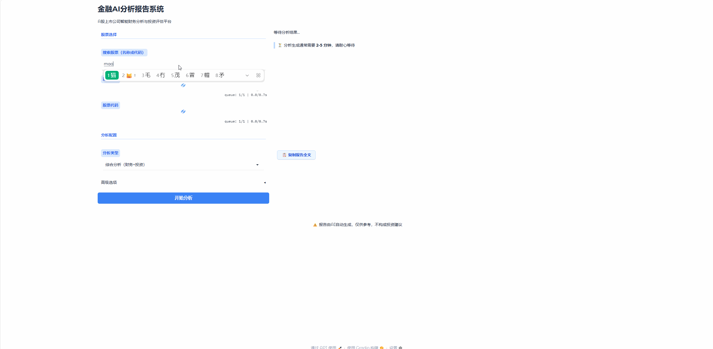
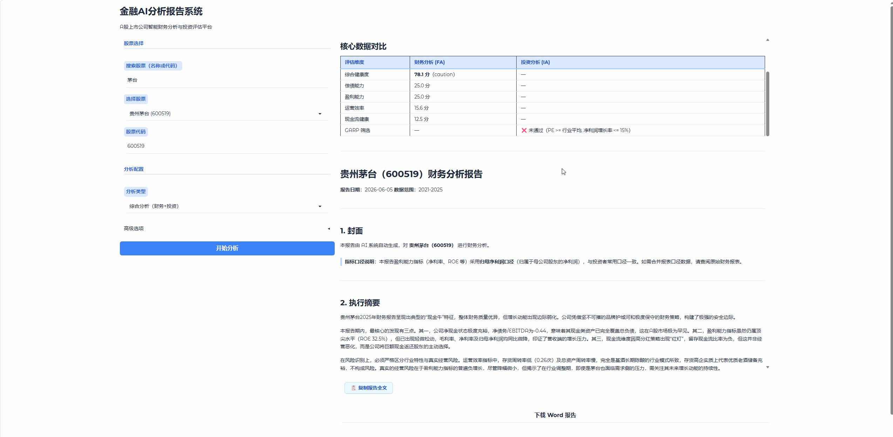
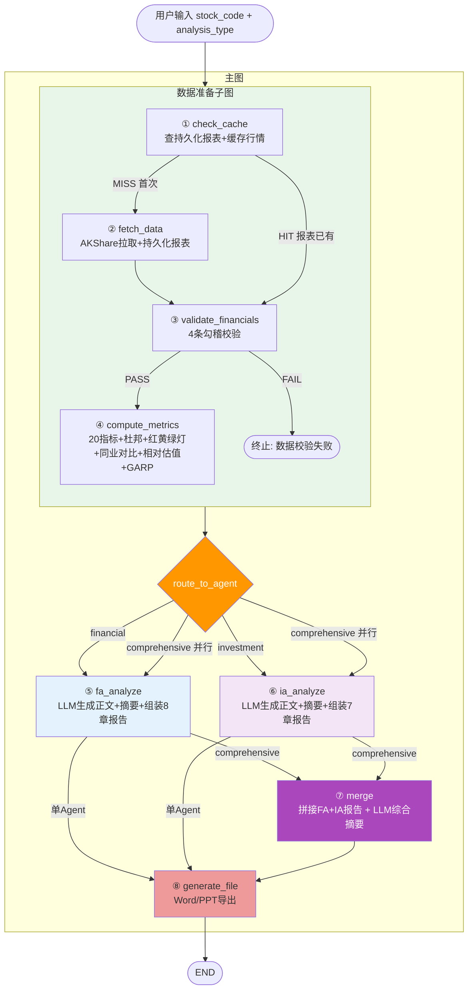

# Finance Analysis Agent

基于 LangGraph 的 A 股上市公司 AI 分析报告系统。输入股票代码，自动生成财务分析 / 投资分析 / 综合分析报告。

## 在线演示

**[Hugging Face Spaces Demo](https://closure-guo-finance-analysis-agent.hf.space)** — 打开网页即可体验，输入自己的 DeepSeek API Key 即可使用。

### 股票搜索与配置



### 报告生成与下载



## 架构



四层架构：

| 层级     | 选型            | 职责                                               |
| -------- | --------------- | -------------------------------------------------- |
| L1 前端  | Gradio 5.x      | 表单输入 + 报告展示 + 文件下载                     |
| L2 Agent | LangGraph       | 8 节点 + 条件路由 + 并行派发                       |
| L3 数据  | pandas + SQLite | AKShare 拉取 + 20 指标计算 + 报表持久化 + 行情缓存 |
| L4 LLM   | DeepSeek        | LiteLLM 路由                                       |

## 快速开始

**环境要求**：Python >= 3.12, uv

```bash
# 安装依赖
uv sync

# 启动
uv run python -m finance_agent.app
```

浏览器打开 Gradio 页面，输入股票代码（如 600519）即可。

## 环境变量配置

首次运行前需要配置 LLM API Key，否则会报错。

```bash
# 复制模板并填入你的 API Key
cp .env.example .env
```

### 变量一览

| 变量 | 必填 | 默认值 | 说明 |
|------|------|--------|------|
| `LLM_API_KEY` | **是** | — | LLM API Key；也可用 `DEEPSEEK_API_KEY` 作为回退 |
| `LLM_MODEL` | 否 | `deepseek/deepseek-v4-pro` | 模型名，litellm 格式 |
| `LLM_BASE_URL` | 否 | `https://api.deepseek.com` | API 端点 |
| `LLM_THINKING` | 否 | `enabled` | 思考模式 `enabled` / `disabled` |
| `LLM_REASONING_EFFORT` | 否 | `max` | 思考强度 `low` / `high` / `max` |
| `REPORTS_DIR` | 否 | `reports` | 报告输出目录 |
| `EVENT_SOURCE` | 否 | `auto` | 事件数据源 `builtin` / `web` / `auto` |

### 示例

**使用 DeepSeek（默认）**：

```bash
# .env
LLM_API_KEY=sk-xxxxxxxxxxxxxxxx
```

**使用其他 LLM（通过 litellm 格式）**：

```bash
# .env
LLM_API_KEY=sk-xxxxxxxxxxxxxxxx
LLM_MODEL=openai/gpt-4o
LLM_BASE_URL=https://api.openai.com/v1
```

## 项目结构

```
src/finance_agent/
├── graph.py              # LangGraph 主图 + 条件路由
├── state.py              # AnalysisState TypedDict
├── app.py                # Gradio 前端入口
├── app_search.py         # 股票搜索
├── formatters.py         # LLM 上下文格式化
├── routing.py            # 路由函数
├── llm.py                # LLM 调用封装
├── nodes/                # 图节点
│   ├── cache.py          # check_cache
│   ├── fetch.py          # fetch_data
│   ├── validate.py       # validate_financials (勾稽校验)
│   ├── compute.py        # compute_metrics
│   ├── fa.py             # fa_analyze (正文+摘要+8章组装)
│   ├── ia.py             # ia_analyze (正文+摘要+7章组装)
│   ├── merge.py          # merge (综合报告合并)
│   └── output.py         # generate_file (Word/PPT 生成)
├── metrics/              # 指标计算（纯函数）
│   ├── validate.py       # 勾稽校验 4 规则
│   ├── solvency.py       # 偿债 5 指标
│   ├── profitability.py  # 盈利 5 指标
│   ├── efficiency.py     # 运营 4 指标
│   ├── cashflow.py       # 现金流 6 指标
│   ├── dupont.py         # 杜邦 3 层分解
│   ├── traffic_light.py  # 红黄绿灯 + 健康度评分
│   ├── relative.py       # 相对估值
│   └── garp.py           # GARP 筛选
├── data/                 # 数据层
│   ├── akshare_client.py # AKShare API 封装
│   └── cache.py          # SQLite 持久化 + 缓存
├── events/               # 关键事件获取
│   ├── pipeline.py       # 事件管线（3 级降级）
│   ├── preset_loader.py  # L1 预设事件
│   ├── web_fetcher.py    # L2 DuckDuckGo 搜索
│   └── fallback.py       # L3 兜底注释
├── export/               # 报告导出
│   ├── parser.py         # Markdown 解析器
│   ├── docx_exporter.py  # Word 导出
│   └── pptx_exporter.py  # PPT 导出
├── prompts/              # LLM prompt
└── templates/            # 报告模板
```

## 实施阶段

- [x] **P0 骨架** — 脚手架 + 空图 + Gradio 表单 + stub happy path
- [x] **P1 数据层** — AKShare + 20 指标 + 缓存 + FA 报告
- [x] **P2 分析层** — IA Agent + prompt 工程 + 投资报告
- [x] **P3 输出层** — 综合分析 + Word/PPT 导出 + UI 打磨

## 文档

- [PRD](docs/PRD.md) — 产品需求文档
- [架构设计](docs/architecture.md) — 系统架构详细设计
- [领域上下文](CONTEXT.md) — 术语表和分析框架定义
- [ADR](docs/adr/) — 架构决策记录

## License

MIT
