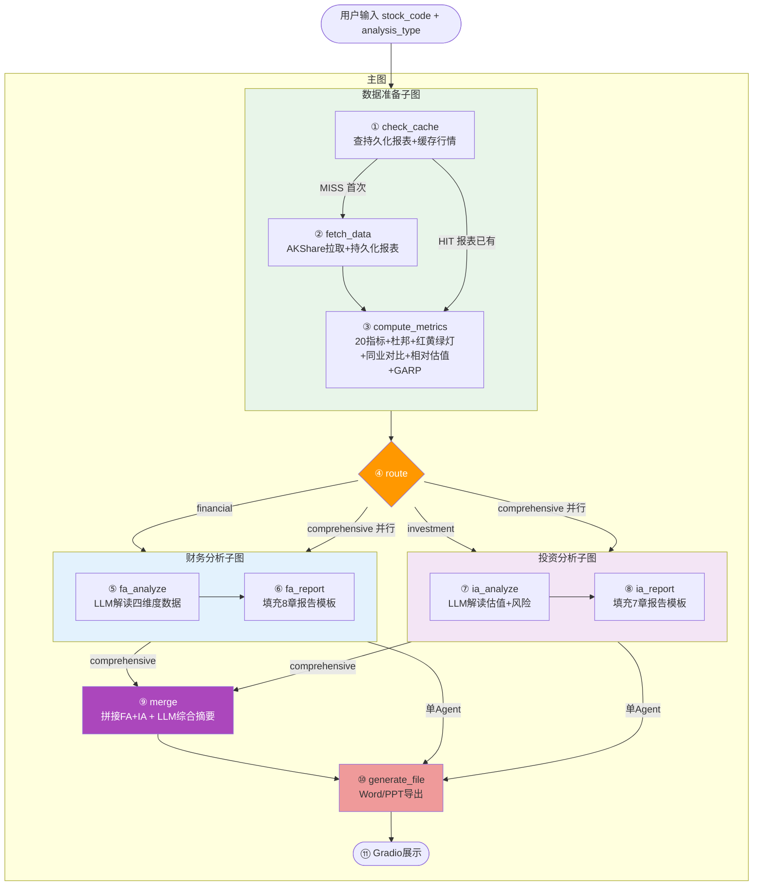

# Finance Analysis Agent

基于 LangGraph 的 A 股上市公司 AI 分析报告系统。输入股票代码，自动生成财务分析 / 投资分析 / 综合分析报告。

## 架构



四层架构：

| 层级     | 选型            | 职责                                               |
| -------- | --------------- | -------------------------------------------------- |
| L1 前端  | Gradio 5.x      | 表单输入 + 报告展示 + 文件下载                     |
| L2 Agent | LangGraph       | 11 节点 + 条件路由 + 并行子图                      |
| L3 数据  | pandas + SQLite | AKShare 拉取 + 20 指标计算 + 报表持久化 + 行情缓存 |
| L4 LLM   | DeepSeek / Qwen | LiteLLM 路由                                       |

## 快速开始

**环境要求**：Python >= 3.12, uv

```bash
# 安装依赖
uv sync

# 启动
uv run python -m finance_agent.app
```

浏览器打开 Gradio 页面，输入股票代码（如 600519）即可。

## 项目结构

```
src/finance_agent/
├── graph.py              # LangGraph 主图 + 条件路由
├── state.py              # AnalysisState TypedDict
├── app.py                # Gradio 前端入口
├── routing.py            # 路由函数
├── nodes/                # 图节点
│   ├── cache.py          # check_cache
│   ├── fetch.py          # fetch_data
│   ├── compute.py        # compute_metrics
│   ├── fa.py             # 财务分析子图
│   ├── ia.py             # 投资分析子图
│   ├── merge.py          # 综合合并
│   └── output.py         # Word/PPT 生成
├── metrics/              # 指标计算（纯函数）
│   ├── solvency.py       # 偿债 5 指标
│   ├── profitability.py  # 盈利 5 指标
│   ├── efficiency.py     # 运营 4 指标
│   ├── cashflow.py       # 现金流 6 指标
│   ├── dupont.py         # 杜邦 3 层分解
│   ├── traffic_light.py  # 红黄绿灯 + 评分
│   ├── relative.py       # 相对估值
│   └── garp.py           # GARP 筛选
├── data/                 # 数据层
│   ├── akshare_client.py # AKShare API 封装
│   └── cache.py          # SQLite 持久化 + 缓存
├── prompts/              # LLM prompt
└── templates/            # 报告模板
```

## 实施阶段

- [x] **P0 骨架** — 脚手架 + 空图 + Gradio 表单 + stub happy path
- [ ] **P1 数据层** — AKShare + 20 指标 + 缓存 + FA 报告
- [ ] **P2 分析层** — IA Agent + prompt 工程 + 投资报告
- [ ] **P3 输出层** — 综合分析 + Word/PPT 导出 + UI 打磨

## 文档

- [PRD](docs/PRD.md) — 产品需求文档
- [架构设计](docs/architecture.md) — 系统架构详细设计
- [领域上下文](CONTEXT.md) — 术语表和分析框架定义
- [ADR](docs/adr/) — 架构决策记录

## License

MIT
