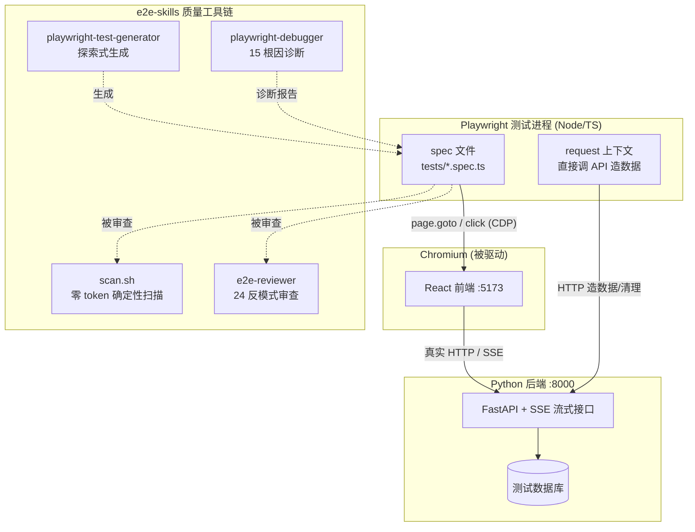
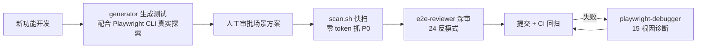

# finance_analysis_agent E2E 测试实现方案

> 目标：为 React 前端 + Python 后端 + SSE 流式输出建立端到端测试体系，核心解决"测试全绿但交互实际损坏"的验证盲区。
> 技术选型：TS 版 Playwright（E2E 只测浏览器行为，与后端语言无关）+ voidmatcha/e2e-skills 质量工具链。

---

## 1. 总体架构



**核心原则**

1. 断言"稳定的可观察状态"，不断言"瞬时的过程"
2. 只用 web-first assertion（自动重试），禁止手动取值断言
3. 先探索后编码：任何 selector 必须来自真实浏览器快照，禁止盲写
4. 功能坏了测试必须红——所有"条件绕过"式防御代码都是反模式

---

## 2. 目录结构

```
finance_analysis_agent/
├── backend/                 # FastAPI（不动）
├── frontend/                # React（不动）
└── e2e/                     # 新增：独立 TS Playwright 项目
    ├── package.json
    ├── playwright.config.ts
    ├── .auth/               # 登录态 storageState（gitignore）
    ├── fixtures/
    │   └── seed.ts          # 测试数据准备
    ├── tests/
    │   ├── smoke.spec.ts        # 冒烟：页面可达
    │   ├── streaming.spec.ts    # 流式分析核心链路
    │   ├── contract.spec.ts     # 前后端网络契约
    │   └── interaction.spec.ts  # 交互状态（loading/颜色/禁用态）
    └── playwright-report/   # 失败证据（gitignore）
```

初始化：

```bash
mkdir e2e && cd e2e
npm init -y
npm i -D @playwright/test
npx playwright install chromium
```

---

## 3. playwright.config.ts：双 webServer 拉起全栈

```typescript
import { defineConfig } from '@playwright/test'

export default defineConfig({
  testDir: './tests',
  timeout: 30_000,
  expect: { timeout: 5_000 },        // web-first assertion 的重试窗口
  fullyParallel: true,
  retries: process.env.CI ? 1 : 0,   // CI 重试一次以暴露 flaky
  reporter: [['list'], ['html', { open: 'never' }]],

  use: {
    baseURL: 'http://localhost:5173',
    trace: 'retain-on-failure',      // 失败保留 trace，供 debugger 诊断
    screenshot: 'only-on-failure',
  },

  webServer: [
    {
      // Python 后端：测试库 + 测试用 LLM stub（见第 5 节）
      command: 'cd ../backend && TESTING=1 uvicorn main:app --port 8000',
      url: 'http://localhost:8000/health',
      timeout: 30_000,
      reuseExistingServer: !process.env.CI,
    },
    {
      command: 'cd ../frontend && npm run dev -- --port 5173',
      url: 'http://localhost:5173',
      timeout: 30_000,
      reuseExistingServer: !process.env.CI,
    },
  ],
})
```

后端需要一个 `/health` 端点（没有就加一个，三行代码），Playwright 靠轮询它确认后端就绪。

---

## 4. 后端测试模式：`TESTING=1` 开关

在 FastAPI 启动逻辑里读环境变量：

```python
# backend/main.py
TESTING = os.getenv("TESTING") == "1"

if TESTING:
    # 1. 指向独立测试数据库（绝不碰开发库）
    # 2. LLM 客户端替换为可控 stub（见下）
    pass
```

**LLM stub（流式测试的关键）**：让 SSE 接口在测试模式下按可控节奏吐固定 delta，这样流式断言是确定性的：

```python
# 伪代码：测试模式下 analyze 接口改用 stub
async def fake_llm_stream():
    for chunk in ["Phase 1: ", "营收分析…", "Phase 2: ", "风险点…"]:
        yield f"data: {chunk}\n\n"
        await asyncio.sleep(0.1)   # 控制节奏
    yield "data: [DONE]\n\n"
```

---

## 5. 三层测试设计

### 5.1 流式核心链路（streaming.spec.ts）

照搬验证过的成熟模式：断言累积状态 + 指示器生命周期 + 断连降级。

```typescript
import { test, expect } from '@playwright/test'

test('流式分析：增量渲染 + 指示器生命周期', async ({ page }) => {
  await page.goto('/analysis')
  await page.getByPlaceholder('输入股票代码').fill('300308')
  await page.getByRole('button', { name: '开始分析' }).click()

  const stream = page.getByTestId('stream-output')

  // 状态断言，自动重试，不赌时序
  await expect(page.getByTestId('stream-status')).toBeVisible()      // 流开始
  await expect(stream).toContainText('Phase 1')                      // 第一帧到达
  await expect(stream).toContainText('Phase 2')                      // 增量累积
  await expect(page.getByTestId('stream-status')).toBeHidden()       // 流结束
})

test('流式分析：中断保留部分内容并显示重试', async ({ page }) => {
  // 用 page.route 模拟中途断连
  await page.route('**/api/analyze', route => route.abort())
  await page.goto('/analysis')
  // …触发分析
  await expect(page.getByTestId('stream-error')).toBeVisible()
  await expect(page.getByRole('button', { name: '重试' })).toBeVisible()
})
```

### 5.2 前后端契约（contract.spec.ts）

直接验证交互逻辑——前端发的请求和后端回的响应：

```typescript
test('点击分析发出正确请求并收到 SSE', async ({ page }) => {
  const reqPromise = page.waitForRequest(r => r.url().includes('/api/analyze'))
  const respPromise = page.waitForResponse(
    r => r.url().includes('/api/analyze') && r.status() === 200
  )

  await page.goto('/analysis')
  await page.getByRole('button', { name: '开始分析' }).click()

  const req = await reqPromise
  expect(req.postDataJSON()).toMatchObject({ symbol: '300308' })

  const resp = await respPromise
  expect(resp.headers()['content-type']).toContain('text/event-stream')
})
```

### 5.3 交互状态（interaction.spec.ts）

颜色/禁用态用 `toHaveCSS` 断言计算后样式，靠自动重试等过渡完成：

```typescript
test('分析中按钮禁用并变色', async ({ page }) => {
  const btn = page.getByRole('button', { name: '开始分析' })
  await page.goto('/analysis')
  await btn.click()

  await expect(btn).toBeDisabled()
  await expect(btn).toHaveCSS('opacity', '0.5')   // 等 transition 完成后的终态
})
```

### 5.4 数据准备（fixtures/seed.ts）

用 `request` 上下文直接调 Python API 造数据，不经过 UI：

```typescript
test.beforeEach(async ({ request }) => {
  await request.post('http://localhost:8000/api/test/seed', {
    data: { symbol: '300308', period: '2024Q4' },
  })
})
```

（后端在 `TESTING=1` 下暴露 `/api/test/seed` 和 `/api/test/reset`，仅测试环境可用。）

---

## 6. 接入 e2e-skills 质量工具链

```bash
# 安装（Claude Code / Trae 通用）
npx skills add voidmatcha/e2e-skills -g --all
```

日常工作流：



要点：

- generator 运行前确保 agent 配有 Playwright MCP 或 CLI，否则退化为静态快照，探索不到弹窗和多步流程
- generator 首次运行会把 E2E 规范写入项目 `AGENTS.md` 并指定种子 spec，后续所有会话按同一纪律写测试
- 存量代码先跑 `bash .../scan.sh e2e/tests` 再跑 reviewer，P0 优先修，一次只修一个反模式家族

---

## 7. CI 集成（GitHub Actions 示例）

```yaml
# .github/workflows/e2e.yml
name: e2e
on: [push, pull_request]
jobs:
  e2e:
    runs-on: ubuntu-latest
    steps:
      - uses: actions/checkout@v4
      - uses: actions/setup-node@v4
        with: { node-version: 22 }
      - uses: actions/setup-python@v5
        with: { python-version: '3.12' }
      - run: pip install -r backend/requirements.txt
      - run: npm ci --prefix frontend && npm ci --prefix e2e
      - run: npx playwright install --with-deps chromium
        working-directory: e2e
      - run: npx playwright test
        working-directory: e2e
      - uses: actions/upload-artifact@v4
        if: failure()
        with:
          name: playwright-report
          path: e2e/playwright-report/
```

失败时下载 report artifact，本地交给 debugger skill 诊断。

---

## 8. 落地路线（建议按阶段推进）

| 阶段 | 内容 | 验收标准 |
|---|---|---|
| P1 骨架（半天） | e2e/ 初始化、双 webServer、/health 端点、TESTING 开关、冒烟 spec | `npx playwright test` 全链路拉起并跑通 smoke |
| P2 核心链路（1 天） | LLM stub、streaming.spec 三个场景（正常/中断/异常）、contract.spec | 流式行为被确定性验证；断开后端，测试变红 |
| P3 质量工具链（半天） | 装 e2e-skills、跑 scan + reviewer、AGENTS.md 规范落地 | 存量测试 P0 清零 |
| P4 CI（半天） | GitHub Actions、trace artifact | PR 上自动跑，失败可查证据 |
| P5 扩展 | interaction.spec 补交互态、generator 补覆盖率缺口 | 核心用户路径全覆盖 |

---

## 9. 反模式红线（写进 AGENTS.md）

```markdown
- ❌ 禁止 `assert locator is not None` / `toBeDefined()` 这类恒真断言（P0）
- ❌ 禁止 expect 缺 await（P0）
- ❌ 禁止 `is_visible()` 手动取值后断言（P1，用 web-first assertion）
- ❌ 禁止 `if (await x.is_visible()) { 断言 }` 条件绕过（P1）
- ❌ 禁止 `waitForTimeout` 赌时序（用 expect 的自动重试或等待具体事件）
- ✅ 所有 selector 必须来自真实浏览器快照（data-testid / role+name 优先）
- ✅ 断言终态，不断言过渡过程
```
