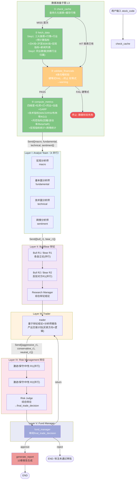
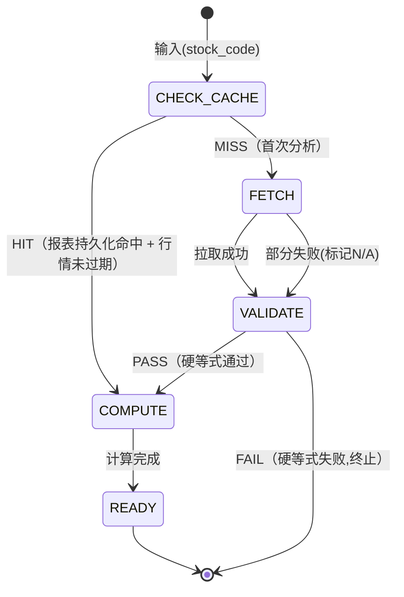

# 金融AI分析报告系统 — 架构设计

> 基于架构设计文档讨论的最终确定方案。所有决策记录在 `docs/adr/` 中。

> **注意**: 本文档已按 ADR-0011 更新为 5 层多 Agent 架构。FA/IA 双 Agent 模型已废弃。

---

## 一、系统全景

### 1.1 四层架构

| 层级     | 选型                          | 职责                                                                |
| -------- | ----------------------------- | ------------------------------------------------------------------- |
| L1 前端  | React 18 + Vite               | 表单输入（股票搜索+分析类型+对标股）+ 报告展示 + 文件下载           |
| L2 Agent | LangGraph                     | 5 层架构: 4 分析师并行 + Bull/Bear 辩论 + Trader + Risk Management 辩论 + Fund Manager |
| L3 数据  | pandas + SQLite               | AKShare 数据拉取 + 全部计算 + SQLite 缓存（v2.0 计划 Chroma）       |
| L4 LLM   | DeepSeek (deepseek-chat)      | LiteLLM 路由                                                        |

### 1.2 核心原则

- **分层单向**：L3 管数据进出 → L2 管思考 → L1 管展示
- **PREP 一次性注入**：PREP 子图全量拉取数据并计算指标后，一次性注入各 Agent 的 prompt context，Agent 无 tool calling（数据需求确定性，LLM 无决策空间）
- **结构化输出 + Claim 校验**：Agent 间通信使用 Pydantic 结构化对象（AnalystReport/DebateMessage/TradeDecision），按 Agent 粒度嵌入 Claim 并校验（data/computational/event 溯源）
- **指标硬编码**：四维度 20 指标 + 阈值 + 杜邦 + 红黄绿灯 + 技术指标 + 风控指标，全部代码硬编码

---

## 二、图拓扑：5 层多 Agent



**静态拓扑顺序（LangGraph 静态展开，无循环边）：**

```
START → check_cache → [fetch_data →] validate → compute_metrics
  → Send([macro, fundamental, technical, sentiment])
  → Send([bull_r1, bear_r1])
  → Send([bull_r2, bear_r2])
  → research_manager
  → trader
  → Send([aggressive_r1, conservative_r1, neutral_r1])
  → Send([aggressive_r2, conservative_r2, neutral_r2])
  → risk_judge
  → fund_manager
  → [trader（如果退回）] 或 generate_report
  → END
```

> 注：Fund Manager 的 `return → trader` 退回最多 1 次（防死循环），通过条件路由实现，不计入静态展开的循环边。各层 `Send` 并行派发由 LangGraph `Send` API 实现，不是独立节点。

---

## 三、节点详细规格

### 3.1 PREP 子图（L3 数据准备，无 LLM）

| #   | 节点                | 读 State                             | 写 State                                 | LLM |
| --- | ------------------- | ------------------------------------ | ---------------------------------------- | --- |
| ①   | check_cache         | stock_code                           | 命中时填充 PREP 全部字段                  | 否  |
| ②   | fetch_data          | missing_items                        | 三大报表+行情+行业+预计算指标+日K线+沪深300K线+宏观指标+新闻列表+同业数据 | 否  |
| ③   | validate_financials | 三大报表                             | validation_result + warnings             | 否  |
| ④   | compute_metrics     | PREP 原始数据                        | 四维度+杜邦+灯+同业+相对估值+GARP+技术指标+风控指标+宏观统计+舆情统计 | 否  |

### 3.2 Layer I: Analyst Team（4 并行，LLM）

| #   | 节点            | 读 State                                          | 写 State                              | LLM |
| --- | --------------- | ------------------------------------------------- | ------------------------------------- | --- |
| ⑤a  | macro           | 宏观指标+政策动态+key_events                       | analyst_reports["macro"]              | 是  |
| ⑤b  | fundamental     | 三大报表+四维度+杜邦+估值+同业                     | analyst_reports["fundamental"]        | 是  |
| ⑤c  | technical       | K线序列+MACD/RSI/布林带/KDJ                        | analyst_reports["technical"]          | 是  |
| ⑤d  | sentiment       | 新闻列表+key_events                               | analyst_reports["sentiment"]          | 是  |

### 3.3 Layer II: Bull/Bear 辩论（LLM）

| #   | 节点              | 读 State                              | 写 State                          | LLM |
| --- | ----------------- | ------------------------------------- | --------------------------------- | --- |
| ⑥   | bull_r1           | 4 份分析师报告                         | debate_history(Bull 立论)          | 是  |
| ⑦   | bear_r1           | 4 份分析师报告                         | debate_history(Bear 立论)          | 是  |
| ⑧   | bull_r2           | 4 份分析师报告 + 对方 R1 论点          | debate_history(Bull 反驳)          | 是  |
| ⑨   | bear_r2           | 4 份分析师报告 + 对方 R1 论点          | debate_history(Bear 反驳)          | 是  |
| ⑩   | research_manager  | debate_history(辩论全量)              | debate_history(综合结论)           | 是  |

### 3.4 Layer III: Trader（LLM）

| #   | 节点   | 读 State                          | 写 State                    | LLM |
| --- | ------ | --------------------------------- | --------------------------- | --- |
| ⑪   | trader | 分析师报告 + Research Manager 结论 | trade_decision(买卖方向+逻辑) | 是  |

### 3.5 Layer IV: Risk Management 辩论（LLM）

| #   | 节点              | 读 State                                    | 写 State                          | LLM |
| --- | ----------------- | ------------------------------------------- | --------------------------------- | --- |
| ⑫   | aggressive_r1     | trade_decision + 分析师报告 + 风控指标       | debate_history(激进立论)          | 是  |
| ⑬   | conservative_r1   | trade_decision + 分析师报告 + 风控指标       | debate_history(保守立论)          | 是  |
| ⑭   | neutral_r1        | trade_decision + 分析师报告 + 风控指标       | debate_history(中立立论)          | 是  |
| ⑮   | aggressive_r2     | trade_decision + 对方 R1 论点                | debate_history(激进反驳)          | 是  |
| ⑯   | conservative_r2   | trade_decision + 对方 R1 论点                | debate_history(保守反驳)          | 是  |
| ⑰   | neutral_r2        | trade_decision + 对方 R1 论点                | debate_history(中立反驳)          | 是  |
| ⑱   | risk_judge        | debate_history(Risk 辩论全量)                | trade_decision(final_trade_decision) | 是  |

### 3.6 Layer V + 报告生成

| #   | 节点            | 读 State                    | 写 State                              | LLM |
| --- | --------------- | --------------------------- | ------------------------------------- | --- |
| ⑲   | fund_manager    | final_trade_decision        | fund_manager_decision(approve/reject/return) | 是  |
| ⑳   | generate_report | 全部 Agent 输出 + PREP 指标 | file_path + file_paths                | 是  |

> 注：Layer I/II/IV 的并行派发通过 LangGraph `Send` API 实现，不是独立路由节点。每个 Agent 输出专属 Pydantic schema（结构化分析对象 + 章节 Markdown）。PREP 风控指标（回撤/波动率/Beta/VaR）作为 prompt context 注入 Layer IV，不用工具查。Claim 校验按 Agent 粒度：基本面/风控强制 data+computational 溯源，舆情强制 event 溯源，宏观标注 `llm_inference` 跳过，技术面数字部分 `field_ref`。

---

## 四、数据持久化与缓存

### 4.1 数据分层策略

| 策略       | 数据               | 存储方式                 | 原因                                     |
| ---------- | ------------------ | ------------------------ | ---------------------------------------- |
| **持久化** | 三大报表           | SQLite                   | 历史事实不可变，拉一次存下来，新季度追加 |
| **缓存**   | 行情数据           | SQLite（TTL 到当日收盘） | 每天变动                                 |
| **缓存**   | 行业归属           | SQLite（TTL 30 天）      | 极少变                                   |
| **缓存**   | AKShare 预计算指标 | SQLite（TTL 同报表）     | 跟随报表时效                             |
| **缓存**   | 行业 PE            | SQLite（TTL 1 天）       | 每天变动                                 |
| **不存储** | L3 衍生计算        | 每次重算                 | 纯 pandas，无 API，毫秒级                |

### 4.2 自动追踪（v2.0 计划）

| 用途                                         | 方式        | 备注                    |
| -------------------------------------------- | ----------- | ----------------------- |
| 断点恢复                                     | SqliteSaver | 本地，不跨会话（未接入）|
| 历史观测（每节点 I/O + 耗时 + token + 异常） | LangSmith   | 云端，30 天保留，零代码（未接入）|

### 4.3 缓存状态机



两条执行路径：

| 路径 | 触发条件                    | 经过节点                                                        | API 调用                  | 耗时      |
| ---- | --------------------------- | --------------------------------------------------------------- | ------------------------- | --------- |
| HIT  | 报表持久化命中 + 行情未过期 | check_cache → validate → compute → Layer I-V Agent 流           | 0（数据）+ 14-20 LLM      | ~75-110s  |
| MISS | 首次分析                    | check_cache → fetch → validate → compute → Layer I-V Agent 流   | 5-8（数据）+ 14-20 LLM    | ~80-115s  |
| FAIL | 硬等式校验失败              | check_cache → [fetch →] validate → END                          | 0-5（数据）               | ~1s       |

> 注：两条路径都进入 5 层 Agent 流（Layer I-V），报告不缓存，LLM 每次重新生成。LLM 调用次数 14（无退回）→ 18（2 轮辩论）→ 20（含 1 次退回），延迟相应增加（ADR-0011）。

### 4.4 fetch_data 内部分步（MVP）

- **Step 1 并行**：三大报表 + 行情 + 行业归属 + 预计算指标 + 日K线 + 沪深300K线 + 宏观指标 + 新闻列表（AKShare，无依赖）
- **Step 2 依赖**：同业公司财务数据（需要 Step 1 的行业归属 + 同业列表）

> v2.0 增加：巨潮 PDF 解析、Chroma 研报 RAG（Tavily 搜索已于 v1.1 纳入快速模式）

---

## 五、四维度 20 指标

### 5.1 指标清单与数据来源

| 维度      | 指标              | 来源   | 说明                                           |
| --------- | ----------------- | ------ | ---------------------------------------------- |
| 偿债(5)   | 资产负债率        | 自算   | 负债合计 / 资产总计                            |
|           | 流动比率          | 自算   | 流动资产 / 流动负债                            |
|           | 速动比率          | 自算   | (流动资产 - 存货) / 流动负债                   |
|           | 利息覆盖倍数      | 自算   | EBIT / 利息费用                                |
|           | 净债务/EBITDA     | 自算   | (有息负债 - 货币资金) / EBITDA                 |
| 盈利(5)   | 毛利率            | 自算   | (营业收入 - 营业成本) / 营业收入               |
|           | 净利率            | 自算   | 归母净利润 / 营业收入                          |
|           | ROE               | 混合   | 优先取 AKShare 加权 ROE；降级自算              |
|           | ROA               | 自算   | 归母净利润 / 资产总计                      |
|           | ROIC              | 自算   | NOPAT / 投入资本                               |
| 运营(4)   | 存货周转率        | 混合   | 优先取 AKShare 预计算；降级自算                |
|           | 应收账款周转率    | 自算   | 营业收入 / 应收账款平均余额                    |
|           | 总资产周转率      | 自算   | 营业收入 / 资产总计                            |
|           | 应付账款周转率    | 自算   | 营业成本 / 应付账款                            |
| 现金流(6) | 经营现金流/净利润 | 自算   | 经营现金流净额 / 归母净利润（缺失时回退合并净利润） |
|           | FCF               | 自算   | 经营现金流净额 - 资本支出                      |
|           | 资本支出/折旧     | 自算   | 资本支出 / 折旧变动                            |
|           | 现金流覆盖比率    | 自算   | FCF / (资本支出 + 利息)                        |
|           | FCF 收益率        | 自算   | FCF / 营业收入 (MVP 简化版)                    |
|           | 留存现金流比率    | 自算   | (FCF - 分红) / FCF                             |

### 5.2 红黄绿灯阈值

**绝对值阈值（部分示例）**：

| 指标       | 🟢 优良  | 🟡 关注  | 🔴 警告 |
| ---------- | -------- | -------- | ------- |
| 资产负债率 | <40%     | 40-65%   | >65%    |
| 流动比率   | >2.0     | 1.0-2.0  | <1.0    |
| ROE        | >15%     | 8-15%    | <8%     |
| FCF        | 正且增长 | 正但下降 | 负值    |

运营效率维度使用固定阈值，白酒/酿酒行业通过 `INDUSTRY_OVERRIDES` 覆盖存货周转率阈值（因基酒需长期陈酿）。

**变化率阈值（统一）**：<20% 🟢 / 20-50% 🟡 / >50% 🔴

### 5.3 评分

四维度各 25 分。🟢=满分 🟡=半分 🔴=零分。
85-100=🟢健康 | 60-84=🟡关注 | <60=🔴警告

### 5.4 杜邦分解（3 层）

```
L1: ROE = 净利率 × 总资产周转率 × 权益乘数
L2: 净利率 → 毛利率 - 费用率
L3: 费用率 → 销售费用率 + 管理费用率 + 研发费用率 + 财务费用率
```

### 5.5 技术指标与风控指标（ADR-0011 新增）

> 本节四维度 20 指标仍由基本面分析师使用（保持有效）。ADR-0011 为技术面分析师和风险管理层新增以下指标模块：

| 模块                | 指标                                  | 服务对象           |
| ------------------- | ------------------------------------- | ------------------ |
| `metrics/technical.py` | MACD / RSI / 布林带 / KDJ          | 技术面分析师（Layer I） |
| `metrics/risk.py`   | max_drawdown / annual_volatility / beta / VaR | 风控辩论（Layer IV，prompt context 注入） |

> 注：风控指标作为 prompt context 直接注入 Layer IV 的 3 个辩论者，不用工具查；技术指标由技术面分析师读取后解读。沪深 300 K 线用于 Beta 计算的基准。

---

## 六、LangGraph State 结构

```python
from typing import TypedDict, Literal
import pandas as pd

class AnalysisState(TypedDict, total=False):
    # ── 输入 ──
    query: str
    stock_code: str
    peer_codes: list[str] | None
    enable_web_search: bool  # 前端开关：是否启用实时事件搜索

    # ── Cache ──
    cache_result: str  # HIT | MISS

    # ── Validation ──
    validation_result: str  # PASS | FAIL
    validation_warnings: list[str]

    # ── Layer 1: 基础公共数据 ──
    balance_sheet: pd.DataFrame
    income_statement: pd.DataFrame
    cash_flow_statement: pd.DataFrame
    stock_quote: dict
    industry_info: dict

    # ── Layer 2: 分析导向 ──
    financial_indicators: pd.DataFrame | None
    industry_pe: dict | None

    # ── Layer 3: 衍生计算 ──
    solvency_metrics: dict
    profitability_metrics: dict
    efficiency_metrics: dict
    cashflow_metrics: dict
    dupont_tree: dict
    growth_rates: dict
    anomalies: list
    traffic_lights: dict
    health_score: dict | None

    # ── Layer 3 扩展: 同业+估值 ──
    peer_financials: pd.DataFrame | None
    peer_comparison: dict | None
    relative_valuation: dict | None
    garp_result: dict | None

    # ── Layer 3 扩展: 季度趋势 ──
    quarterly_income: pd.DataFrame | None
    quarterly_trend: dict | None

    # ── PREP 新增（ADR-0011）──
    kline_data: pd.DataFrame | None          # 个股日K线(1-2年OHLCV)
    market_kline: pd.DataFrame | None        # 沪深300日K线(Beta基准)
    macro_indicators: dict | None            # CPI/PMI/M2/LPR (已移除/未实现)
    news_list: list[dict] | None             # 新闻列表(已移除/未实现)
    technical_indicators: dict | None        # MACD/RSI/布林带/KDJ (metrics/technical.py)
    risk_metrics: dict | None                # max_drawdown/annual_volatility/beta/VaR (metrics/risk.py)

    # ── Layer 3 扩展: 关键非财务事件 ──
    key_events: list[dict] | None

    # ── Agent 输出（嵌套，ADR-0011）──
    analyst_reports: dict[str, AnalystReport]   # 4 分析师结构化报告 {macro|fundamental|technical|sentiment}
    debate_history: list[DebateMessage]         # Bull/Bear + Risk Management 辩论消息流
    trade_decision: TradeDecision               # Trader → Risk Judge 最终交易决策
    fund_manager_decision: str                  # approve | reject | return

    # ── 报告输出 ──
    file_path: str | None
    file_paths: dict | None
```

> 注：PREP 字段保持扁平（兼容现有代码）；Agent 输出改为嵌套结构（`analyst_reports` / `debate_history` / `trade_decision`）。`AnalystReport`、`DebateMessage`、`TradeDecision` 为 Pydantic 模型，含结构化字段 + 章节 Markdown + Claim 列表。

---

## 七、条件路由

```python
# 数据准备子图条件边
def after_check_cache(state):
    result = state["cache_result"]
    if result == "HIT":
        return "validate_financials"  # 报表已有，先校验再算
    return "fetch_data"

# 勾稽校验条件边
def after_validate(state):
    result = state["validation_result"]
    if result == "FAIL":
        return "__end__"  # 硬等式失败，短路终止
    return "compute_metrics"

# Fund Manager 决策条件边（Layer V）
def after_fund_manager(state):
    decision = state.get("fund_manager_decision", "approve")
    # return -> 退回 Trader，最多 1 次防死循环
    if decision == "return" and state.get("return_count", 0) < 1:
        return "trader"
    return "generate_report"  # approve / reject / 退回超限 均进入报告生成
```

> 注：ADR-0011 移除了 `route_to_agent` 和 `after_agent`（不再有 `analysis_type` 路由，4 个分析师始终全量并行执行）。Fund Manager 的 `return -> trader` 退回最多 1 次，通过 `return_count` 计数器防死循环；超过上限后强制进入 `generate_report`。

---

## 八、技术选型

| 层级      | 选型              | 备选            | 决策依据                        |
| --------- | ----------------- | --------------- | ------------------------------- |
| 前端      | React 18 + Vite   | Gradio          | 组件生态 + 状态管理(zustand) + ECharts 图表   |
| Agent     | LangGraph         | CrewAI          | Supervisor + Sub-graph 原生支持 |
| LLM(开发) | deepseek-chat    | Qwen2.5         | 成本 4元/M tokens，中文财务更优 |
| LLM 路由  | LiteLLM           | 自定义          | 100+ 模型统一接口               |
| PDF       | pdfplumber        | Unstructured.io | 表格准确率 98.3%，速度快 6x     |
| 数据      | AKShare           | Tushare         | 免费无 API Key                  |
| 向量      | Chroma            | FAISS           | 本地零配置                      |
| 关系      | SQLite            | PostgreSQL      | 零配置单文件                    |
| 搜索      | Tavily            | Brave           | 为 LLM 优化                     |
| Word      | python-docx       | —               | 程序化生成                      |
| PPT       | python-pptx       | —               | 程序化生成                      |

---

## 九、未决定项

| 问题                     | 选项                                     | 影响                                                                               |
| ------------------------ | ---------------------------------------- | ---------------------------------------------------------------------------------- |
| ~~DCF 的 WACC 假设来源~~ | ~~公式估算 vs LLM 生成 vs 硬编码默认值~~ | ~~已决定：公式估算（CAPM + 利息费用/有息负债）~~                                   |
| ~~项目目录结构~~         | ~~见架构文档~~                           | ~~已决定：src/finance_agent/ 分 nodes/metrics/data/prompts/templates~~ |
| ~~实施阶段划分~~         | ~~P0骨架→P1数据层→P2分析层→P3输出层~~    | ~~已决定：4阶段渐进~~                                                              |

### 补充决定

- **State 使用 TypedDict**：LangGraph 原生一等公民，Reducer/Checkpoint/节点返回值零摩擦
- **实施 4 阶段**：P0 骨架(脚手架+空图+happy path) -> P1 数据层(AKShare+20指标+缓存) -> P2 分析层(Agent+prompt+报告模板) -> P3 输出层(Word/PPT+前端打磨)
- **MVP 范围**：AKShare 数据源 + Tavily 搜索（v1.1 纳入快速模式），无 Chroma/巨潮PDF/DCF 定量计算。v2.0 扩展 DCF、RAG、图表
- **分析年份跨度**：动态，尽量拉 5 年，不足则有多少用多少，最低 2 年（保证同比变化率可计算），低于 2 年报错
- **同业选择**：默认申万同三级行业市值 Top 5；用户可手动输入对标股票代码覆盖自动选取
- **数据降级策略**：必需数据（三大报表）缺失→报错终止；非必需（同业、研报、搜索）缺失→标记 N/A 继续
- **DCF 参数**：预测期 5 年，终端增长率 2%，市场风险溢价 7%（硬编码），无风险利率动态拉取（失败降级 1.8%），FCF 分阶段增长（前 3 年历史均值，后 2 年线性衰减至 g）
- **DCF 输出原则**：输出估值区间 + 敏感性分析（WACC ±1%、g ±0.5%），不输出单一精确数字
