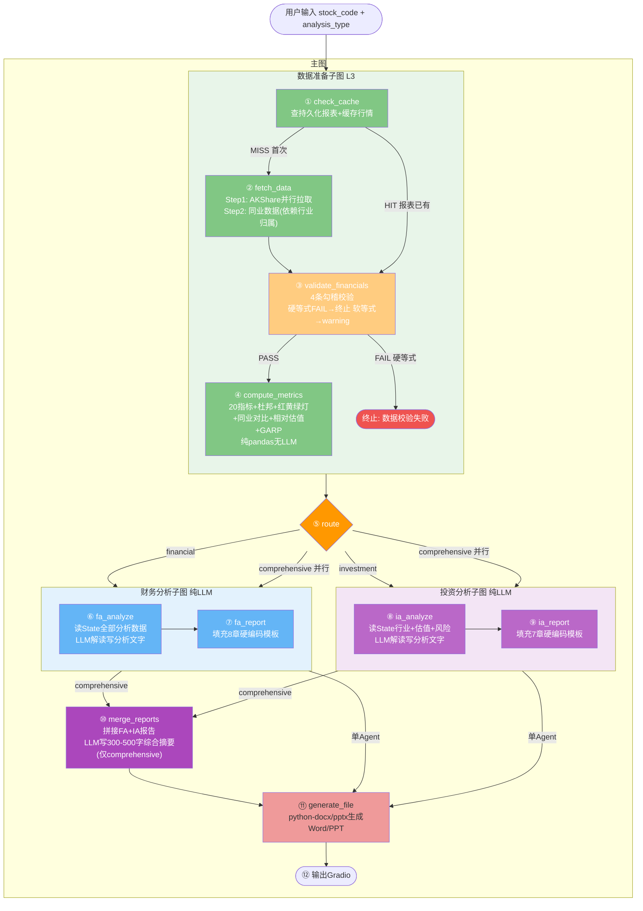
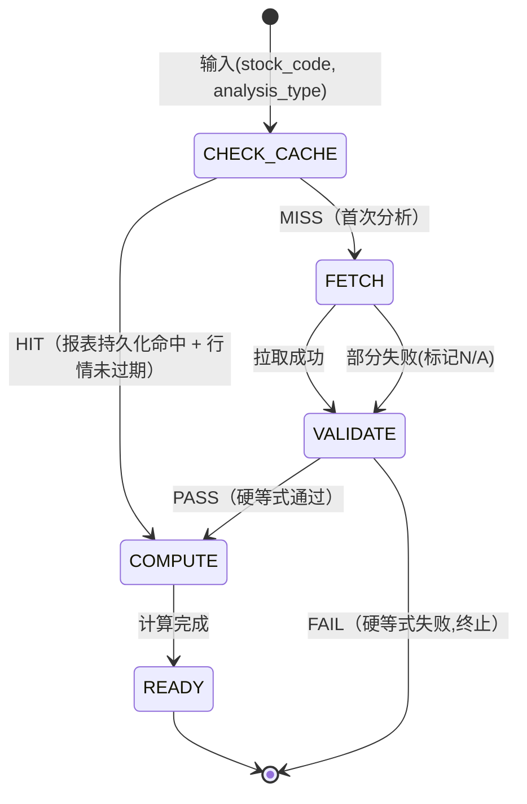

# 金融AI分析报告系统 — 架构设计

> 基于架构设计文档讨论的最终确定方案。所有决策记录在 `docs/adr/` 中。

---

## 一、系统全景

### 1.1 四层架构

| 层级     | 选型                          | 职责                                                                |
| -------- | ----------------------------- | ------------------------------------------------------------------- |
| L1 前端  | Gradio 5.x Blocks API         | 表单输入（股票搜索+分析类型+对标股）+ 报告展示 + 文件下载           |
| L2 Agent | LangGraph                     | 12 节点 + 2 子图 + 数据准备子图 + 条件路由                          |
| L3 数据  | pandas + SQLite               | AKShare 数据拉取 + 全部计算 + SQLite 缓存（MVP 不含 Chroma/Tavily） |
| L4 LLM   | DeepSeek(开发) / GPT-4o(Demo) | LiteLLM 路由 + 降级链                                               |

### 1.2 核心原则

- **分层单向**：L3 管数据进出 → L2 管思考 → L1 管展示
- **Agent 纯 LLM**：Agent 只读 State + 调 LLM，不拉数据、不做计算
- **指标硬编码**：四维度 20 指标 + 阈值 + 杜邦 + 红黄绿灯，全部代码硬编码
- **MVP 无 MCP**：数据拉取和计算直接用 Python 模块，不包 MCP 层
- **MCP 扩展预留**：后期可将整个 Agent 封装为 MCP Server，对外暴露分析能力

---

## 二、图拓扑：12 节点



---

## 三、节点详细规格

| #   | 节点                | 读 State                             | 写 State                          | LLM |
| --- | ------------------- | ------------------------------------ | --------------------------------- | --- |
| ①   | check_cache         | stock_code                           | 命中时填充 L1-L3 全部             | 否  |
| ②   | fetch_data          | missing_items                        | L1+L2+L4 全部原始数据             | 否  |
| ③   | validate_financials | L1 三大报表                          | validation_result + warnings      | 否  |
| ④   | compute_metrics     | L1-L4 原始数据                       | 四维度+杜邦+灯+同业+相对估值+GARP | 否  |
| ⑤   | route               | analysis_type                        | 无                                | 否  |
| ⑥   | fa_analyze          | 四维度+灯+杜邦+同业+异常+warnings    | financial_analysis                | 是  |
| ⑦   | fa_report           | financial_analysis                   | financial_report                  | 是  |
| ⑧   | ia_analyze          | 行业+DCF+估值+GARP+风险              | investment_analysis               | 是  |
| ⑨   | ia_report           | investment_analysis                  | investment_report                 | 是  |
| ⑩   | merge               | financial_report + investment_report | final_report                      | 是  |
| ⑪   | generate_file       | final_report                         | file_path                         | 否  |
| ⑫   | output              | file_path                            | 无                                | 否  |

---

## 四、数据持久化与缓存

### 4.1 数据分层策略

| 策略       | 数据               | 存储方式                 | 原因                                     |
| ---------- | ------------------ | ------------------------ | ---------------------------------------- |
| **持久化** | 三大报表           | SQLite                   | 历史事实不可变，拉一次存下来，新季度追加 |
| **持久化** | 分析报告快照       | SQLite 主表              | 用户历史报告，按标的/时间检索            |
| **缓存**   | 行情数据           | SQLite（TTL 到当日收盘） | 每天变动                                 |
| **缓存**   | 行业归属           | SQLite（TTL 30 天）      | 极少变                                   |
| **缓存**   | AKShare 预计算指标 | SQLite（TTL 同报表）     | 跟随报表时效                             |
| **不存储** | L3 衍生计算        | 每次重算                 | 纯 pandas，无 API，毫秒级                |

### 4.2 自动追踪

| 用途                                         | 方式        | 备注                    |
| -------------------------------------------- | ----------- | ----------------------- |
| 断点恢复                                     | SqliteSaver | 本地，不跨会话          |
| 历史观测（每节点 I/O + 耗时 + token + 异常） | LangSmith   | 云端，30 天保留，零代码 |

### 4.3 缓存状态机



两条执行路径：

| 路径 | 触发条件                    | 经过节点                                                 | API 调用         | 耗时 |
| ---- | --------------------------- | -------------------------------------------------------- | ---------------- | ---- |
| HIT  | 报表持久化命中 + 行情未过期 | check_cache → validate → compute → Route → Agent         | 0（数据）+ LLM   | ~2s  |
| MISS | 首次分析                    | check_cache → fetch → validate → compute → Route → Agent | 5-8（数据）+ LLM | ~8s  |
| FAIL | 硬等式校验失败              | check_cache → [fetch →] validate → END                   | 0-5（数据）      | ~1s  |

> 注：两条路径都走 Route → Agent，因为分析报告不缓存，LLM 每次重新生成。

### 4.4 fetch_data 内部分步（MVP）

- **Step 1 并行**：三大报表 + 行情 + 行业归属 + 预计算指标（AKShare，无依赖）
- **Step 2 依赖**：同业公司财务数据（需要 Step 1 的行业归属 + 同业列表）

> v2.0 增加：Tavily 搜索（依赖行业名称）、巨潮 PDF 解析、Chroma 研报 RAG

---

## 五、四维度 20 指标

### 5.1 指标清单与数据来源

| 维度      | 指标              | 来源    |
| --------- | ----------------- | ------- |
| 偿债(5)   | 资产负债率        | AKShare |
|           | 流动比率          | AKShare |
|           | 速动比率          | AKShare |
|           | 利息覆盖倍数      | 自算    |
|           | 净债务/EBITDA     | 自算    |
| 盈利(5)   | 毛利率            | AKShare |
|           | 净利率            | AKShare |
|           | ROE               | AKShare |
|           | ROA               | AKShare |
|           | ROIC              | 自算    |
| 运营(4)   | 存货周转率        | AKShare |
|           | 应收账款周转率    | AKShare |
|           | 总资产周转率      | AKShare |
|           | 应付账款周转率    | 自算    |
| 现金流(6) | 经营现金流/净利润 | 自算    |
|           | FCF               | 自算    |
|           | 资本支出/折旧     | 自算    |
|           | 现金流覆盖比率    | 自算    |
|           | FCF 收益率        | 自算    |
|           | 留存现金流比率    | 自算    |

10 个 AKShare 预计算 + 11 个自算。

### 5.2 红黄绿灯阈值

**绝对值阈值（部分示例）**：

| 指标       | 🟢 优良  | 🟡 关注  | 🔴 警告 |
| ---------- | -------- | -------- | ------- |
| 资产负债率 | <40%     | 40-65%   | >65%    |
| 流动比率   | >2.0     | 1.0-2.0  | <1.0    |
| ROE        | >15%     | 8-15%    | <8%     |
| FCF        | 正且增长 | 正但下降 | 负值    |

运营效率维度使用行业均值倍数：> 行业均值×1.2 = 🟢。

**变化率阈值（统一）**：<20% 🟢 / 20-50% 🟡 / >50% 🔴

### 5.3 评分

四维度各 25 分。🟢=满分 🟡=半分 🔴=零分。
85-100=🟢健康 | 60-84=🟡关注 | <60=🔴警告

### 5.4 杜邦分解（3 层）

```
L1: ROE = 净利率 × 总资产周转率 × 权益乘数
L2: 净利率 → 毛利率-费用率；周转率 → 存货/应收/固定资产；权益乘数 → 负债结构
L3: 费用率 → 销售费用率 + 管理费用率 + 研发费用率 + 财务费用率
```

---

## 六、LangGraph State 结构

```python
from typing import TypedDict, Optional, Literal
import pandas as pd

class AnalysisState(TypedDict):
    # ── 输入 ──
    query: str
    stock_code: str
    analysis_type: Literal["financial", "investment", "comprehensive"]
    peer_codes: Optional[list[str]]  # 用户手动指定的对标股票，None 则自动选取

    # ── Cache ──
    cache_result: str  # HIT | MISS

    # ── Layer 1: 基础公共 ──
    balance_sheet: pd.DataFrame
    income_statement: pd.DataFrame
    cash_flow_statement: pd.DataFrame
    stock_quote: dict
    industry_info: dict

    # ── Layer 2: 分析导向 (MVP: 仅预计算指标) ──
    financial_indicators: Optional[pd.DataFrame]

    # ── Layer 2 扩展 (v2.0) ──
    # annual_report_text: Optional[str]
    # research_reports: Optional[list[dict]]
    # industry_search: Optional[list[dict]]

    # ── Validation ──
    validation_result: str  # PASS | FAIL
    validation_warnings: list[str]  # 软规则告警（LLM 报告可引用）

    # ── Layer 3: 衍生计算 ──
    solvency_metrics: dict
    profitability_metrics: dict
    efficiency_metrics: dict
    cashflow_metrics: dict
    dupont_tree: dict
    growth_rates: dict
    anomalies: list
    traffic_lights: dict

    # ── Layer 3 扩展: 同业+估值 ──
    peer_financials: Optional[pd.DataFrame]
    peer_comparison: Optional[dict]
    relative_valuation: Optional[dict]
    garp_result: Optional[dict]

    # ── Layer 3 扩展: DCF (v2.0) ──
    # dcf_base: Optional[dict]

    # ── Agent 输出 ──
    financial_analysis: Optional[str]
    financial_report: Optional[str]
    investment_analysis: Optional[str]
    investment_report: Optional[str]
    final_report: Optional[str]
    file_path: Optional[str]
```

---

## 七、条件路由

```python
# 数据准备子图条件边
def after_check_cache(state):
    result = state["cache_result"]
    if result == "HIT":
        return "validate_financials"  # 报表已有，先校验再算
    return "fetch_data"

# 勾稽校验条件边
def after_validate(state):
    result = state["validation_result"]
    if result == "FAIL":
        return "__end__"  # 硬等式失败，短路终止
    return "compute_metrics"

# 主图路由
def route_to_agent(state):
    return state["analysis_type"]

# Agent完成后
def after_agent(state):
    if state["analysis_type"] == "comprehensive":
        return "merge"
    return "generate_file"
```

---

## 八、技术选型

| 层级      | 选型              | 备选            | 决策依据                        |
| --------- | ----------------- | --------------- | ------------------------------- |
| 前端      | Gradio 5.x Blocks | Streamlit       | 表单布局灵活 + share 链接       |
| Agent     | LangGraph         | CrewAI          | Supervisor + Sub-graph 原生支持 |
| LLM(开发) | DeepSeek-V3.2     | Qwen2.5         | 成本 4元/M tokens，中文财务更优 |
| LLM(Demo) | GPT-4o            | Claude 3.5      | 长链推理最强                    |
| LLM 路由  | LiteLLM           | 自定义          | 100+ 模型统一接口               |
| PDF       | pdfplumber        | Unstructured.io | 表格准确率 98.3%，速度快 6x     |
| 数据      | AKShare           | Tushare         | 免费无 API Key                  |
| 向量      | Chroma            | FAISS           | 本地零配置                      |
| 关系      | SQLite            | PostgreSQL      | 零配置单文件                    |
| 搜索      | Tavily            | Brave           | 为 LLM 优化                     |
| Word      | python-docx       | —               | 程序化生成                      |
| PPT       | python-pptx       | —               | 程序化生成                      |

---

## 九、未决定项

| 问题                     | 选项                                     | 影响                                                                               |
| ------------------------ | ---------------------------------------- | ---------------------------------------------------------------------------------- |
| ~~DCF 的 WACC 假设来源~~ | ~~公式估算 vs LLM 生成 vs 硬编码默认值~~ | ~~已决定：公式估算（CAPM + 利息费用/有息负债）~~                                   |
| ~~项目目录结构~~         | ~~见架构文档~~                           | ~~已决定：src/finance_agent/ 分 nodes/metrics/mcp_servers/data/prompts/templates~~ |
| ~~实施阶段划分~~         | ~~P0骨架→P1数据层→P2分析层→P3输出层~~    | ~~已决定：4阶段渐进~~                                                              |

### 补充决定

- **State 使用 TypedDict**：LangGraph 原生一等公民，Reducer/Checkpoint/节点返回值零摩擦
- **实施 4 阶段**：P0 骨架(脚手架+空图+happy path) → P1 数据层(AKShare+20指标+缓存) → P2 分析层(Agent+prompt+报告模板) → P3 输出层(Word/PPT+Gradio打磨)
- **MVP 范围**：仅 AKShare 数据源，无 Tavily/Chroma/巨潮PDF/DCF 定量计算。v2.0 扩展 DCF、外部搜索、RAG、图表
- **分析年份跨度**：动态，尽量拉 5 年，不足则有多少用多少，最低 2 年（保证同比变化率可计算），低于 2 年报错
- **同业选择**：默认申万同三级行业市值 Top 5；用户可手动输入对标股票代码覆盖自动选取
- **数据降级策略**：必需数据（三大报表）缺失→报错终止；非必需（同业、研报、搜索）缺失→标记 N/A 继续
- **DCF 参数**：预测期 5 年，终端增长率 2%，市场风险溢价 7%（硬编码），无风险利率动态拉取（失败降级 1.8%），FCF 分阶段增长（前 3 年历史均值，后 2 年线性衰减至 g）
- **DCF 输出原则**：输出估值区间 + 敏感性分析（WACC ±1%、g ±0.5%），不输出单一精确数字
