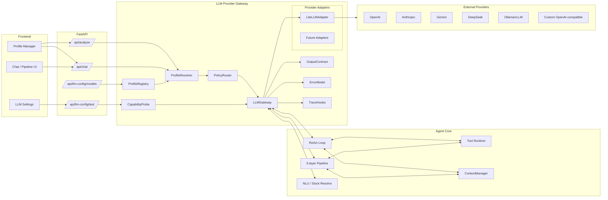
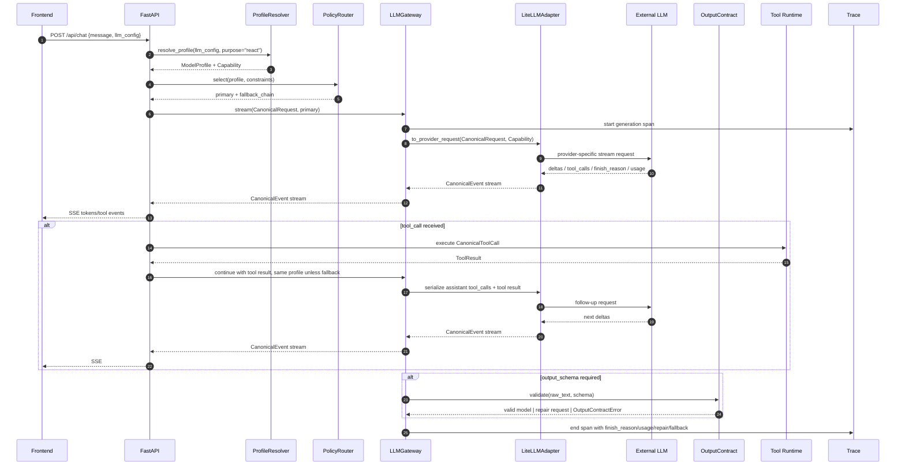
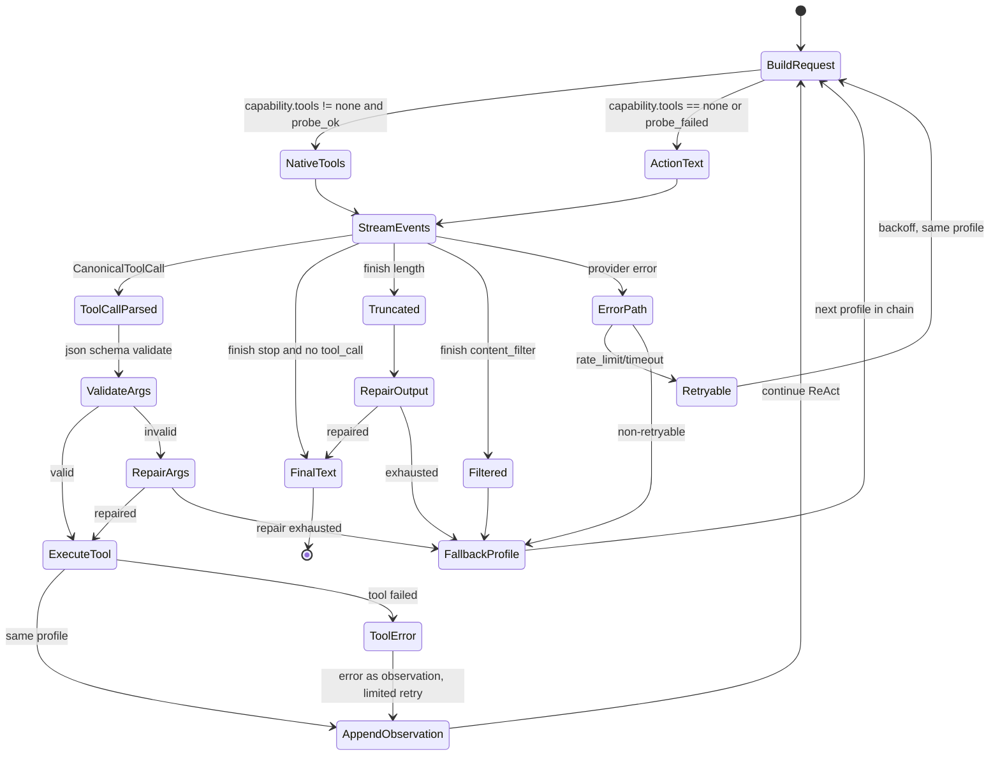
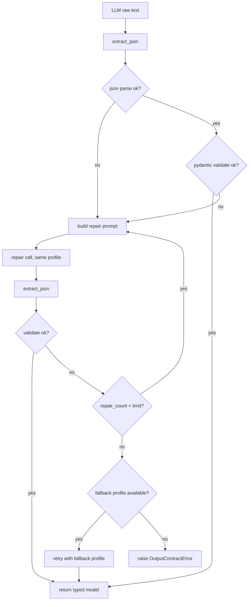

# LLM Provider Gateway 完整架构设计

项目：`closure-guo/finance_analysis_agent`  
文档类型：架构设计  
约束：本文不使用比喻表达，仅使用技术术语。

---

## 1. 背景

系统当前支持通过 LiteLLM 访问多个 LLM 供应商，但供应商相关逻辑分散在 `llm.py`、`harness/litellm_client.py`、`agent_factory.py`、ReAct loop、管线节点和前端配置中。更换 provider 后出现的问题主要集中在以下类别：

1. 请求构造不兼容：system role、tool result、assistant tool_calls、reasoning 字段、`extra_body` 在不同 provider 间语义不同。
2. 工具调用不稳定：native tools、`tool_choice=required`、流式 tool delta、tool result follow-up 的支持程度不一致。
3. 输出合同缺失：结构化输出依赖 prompt 约束和正则提取，缺少统一 schema validation、repair、fallback。
4. 模型解析入口不唯一：`LLM_MODEL`、`LLM_QUICK_MODEL`、请求级 `llm_config`、环境变量、前端 profile 之间存在隐式切换。
5. 参数静默降级：全局 `drop_params=True` 可能丢弃关键参数，使不兼容表现为行为变化而非明确错误。
6. 运行时验证不足：连通性测试只验证短文本返回，未验证 streaming、tool_call、tool_followup、json_output。

架构目标是把 provider 差异限制在独立 Gateway 内，使业务核心只依赖内部 Canonical 协议。

---

## 2. 目标与非目标

### 2.1 目标

- 业务代码不直接访问 LiteLLM 或 provider SDK。
- 业务代码不出现 provider 名称条件分支。
- 所有 LLM 调用经过统一入口：`LLMGateway.complete/stream/with_tools`。
- 每次调用使用完整 `ModelProfile`，不允许 `model/baseUrl/apiKey` 半套配置混合。
- 工具调用参数回放必须是合法 JSON string。
- 结构化输出必须经过 schema validation；失败必须 repair 或 fallback。
- `finish_reason`、错误码、限流、超时、内容过滤必须分类。
- 运行时 probe 与 CI contract tests 共同决定 profile 是否可用于生产路径。

### 2.2 非目标

- 不实现自有 provider 协议栈；LiteLLM 可作为 adapter 内部实现。
- 不承诺不同 provider 输出质量一致；只承诺能力缺失时可降级、可观测、可回滚。
- 第一阶段不实现复杂成本优化、多模型投票或自动博弈策略。

---

## 3. 术语

| 术语 | 定义 |
|---|---|
| Profile | 一组原子化 LLM 配置，包含 provider、model、base_url、api_key、capability、default_params、fallback |
| Capability | profile 的运行能力声明，描述 tools、streaming、json_schema、reasoning、上下文长度等约束 |
| Canonical 协议 | 业务核心与 Gateway 之间使用的内部请求、事件、工具调用、错误格式 |
| Adapter | 将 Canonical 协议转换为具体 provider 请求，并将响应归一化为 Canonical 协议的组件 |
| OutputContract | 结构化输出校验与修复机制，负责 JSON 提取、schema validation、repair、fallback |
| Probe | 运行时能力探测，验证 profile 是否具备 non_stream、stream、tool_call、tool_followup、json_output 能力 |
| Contract Tests | CI 中对每个启用 profile 执行的固定兼容性用例集 |
| Purpose | 调用用途，如 deep、quick、followup、extract、react、pipeline_node、probe；只影响档位和策略，不改变供应商归属 |

---

## 4. 总体架构图



---

## 5. 请求时序图



---

## 6. 配置解析流程

```mermaid
flowchart TD
  Start[resolve_profile] --> HasReq{llm_config provided?}
  HasReq -- no --> UseEnv[use env profile by purpose]
  HasReq -- yes --> Complete{model/baseUrl/apiKey complete enough?}
  Complete -- no --> NamedFallback{fallback to named profile allowed?}
  NamedFallback -- no --> Err1[raise InvalidProfileConfig]
  NamedFallback -- yes --> UseNamed[load named profile]
  Complete -- yes --> Normalize[normalize model/baseUrl/apiKey]
  UseEnv --> Normalize
  UseNamed --> Normalize

  Normalize --> HasSlash{model contains "/" ?}
  HasSlash -- no --> HasBase{base_url present?}
  HasBase -- no --> Err2[raise ModelProviderMissing]
  HasBase -- yes --> ForceOpenAI[model = "openai/" + model]
  HasSlash -- yes --> Known{prefix in registry?}
  Known -- no --> Err3[raise UnsupportedProviderPrefix]
  Known -- yes --> AttachCap[attach capability]
  ForceOpenAI --> AttachCap

  AttachCap --> ProbeCache{probe cache valid?}
  ProbeCache -- yes --> Merge[merge static capability + probe facts]
  ProbeCache -- no --> StaticOnly[use static capability, mark probe_required]
  Merge --> Validate{constraints satisfied?}
  StaticOnly --> Validate
  Validate -- no --> Fallback[select fallback profile or raise UnsupportedCapability]
  Validate -- yes --> Out[return ModelProfile]
  Fallback --> Out
```

---

## 7. 核心数据模型

```python
from dataclasses import dataclass
from typing import Any, Literal

ToolsCap = Literal["none", "single", "parallel"]
JsonCap = Literal["none", "json_mode", "strict_schema"]
Purpose = Literal["deep", "quick", "followup", "extract", "react", "pipeline_node", "probe"]
ToolChoice = Literal["auto", "required", "none"]

@dataclass(frozen=True)
class Capability:
    tools: ToolsCap
    tool_choice_required: bool
    streaming: bool
    streaming_tool_calls: bool
    json_schema: JsonCap
    supports_system_role: bool
    reasoning_field: str | None
    reasoning_must_echo_on_tool: bool
    max_context: int
    max_output: int
    extra_body_allowed: bool
    data_regions: tuple[str, ...] = ()

@dataclass(frozen=True)
class ModelProfile:
    name: str
    provider: str
    model: str
    base_url: str | None
    api_key: str | None
    capability: Capability
    default_params: dict[str, Any]
    provider_options: dict[str, Any]  # provider 特有配置，必须经 registry schema 校验
    fallback: tuple[str, ...] = ()

@dataclass(frozen=True)
class CanonicalRequest:
    messages: list[dict[str, Any]]
    purpose: Purpose
    tools: list[dict[str, Any]] | None
    tool_choice: ToolChoice
    output_schema: type | None
    max_tokens: int
    temperature: float | None
    stream: bool
    trace: dict[str, Any] | None

@dataclass(frozen=True)
class CanonicalToolCall:
    id: str
    name: str
    arguments: dict[str, Any]

@dataclass(frozen=True)
class CanonicalEvent:
    kind: Literal["text", "reasoning", "tool_call", "finished", "error"]
    text: str = ""
    reasoning: str = ""
    tool_call: CanonicalToolCall | None = None
    finish_reason: Literal["stop", "tool_calls", "length", "content_filter", "error", "unknown"] | None = None
    usage: dict[str, int] | None = None
    error: str | None = None
```

序列化不变量：

- 发送到 provider 的 assistant tool_calls 中，`function.arguments` 必须是 `json.dumps(dict)` 的结果。
- tool result 必须携带与原 tool_call 对应的 id；id 映射由 Gateway 维护，不依赖 provider 返回顺序。
- reasoning 字段只在 `capability.reasoning_field` 非空时读取；当 `reasoning_must_echo_on_tool=True` 时，带 tool_calls 的 assistant 消息必须回传该字段。

### 7.1 Provider Options：provider 特有配置

provider 特有配置统一放在 `ModelProfile.provider_options`，不得进入业务代码、prompt 模板或 ReAct 主循环。配置来源分三类：

| 来源 | 位置 | 内容 | 是否敏感 | 是否可运行时修正 |
|---|---|---|---|---|
| registry 静态默认 | `llm/registry.py` | capability 默认值、provider_options schema、default_provider_options、参数白名单 | 否 | 否 |
| 命名 profile | env、secret manager、DB；前端仅编辑非敏感字段或持有 secret ref | model、base_url、api_key_ref、provider_options 覆盖值、fallback | 含 api_key 时为是 | 否 |
| probe 事实 | probe cache | tool_call、tool_followup、stream、json_output 等运行时能力 | 否 | 是，仅修正 capability，不修正密钥 |

合并优先级：

```text
registry default_provider_options
  < named profile.provider_options
  < 请求级 llm_config.provider_options 中允许覆盖的白名单字段
  = 最终 ModelProfile.provider_options
```

capability 的事实来源不同：registry 静态 capability 与 probe 结果冲突时，以 probe 结果为准并记录 warning；probe 不修改 provider_options，不修改密钥。

示例：

```python
class DeepSeekOptions(BaseModel):
    thinking: Literal["enabled", "disabled"] | None = None
    reasoning_effort: Literal["low", "high", "max"] | None = None

class OpenAIOptions(BaseModel):
    organization: str | None = None
    project: str | None = None
```

profile 示例：

```json
{
  "name": "deepseek-main",
  "provider": "deepseek",
  "model": "deepseek/deepseek-chat",
  "base_url": "https://api.deepseek.com/v1",
  "api_key_ref": "secret://llm/deepseek-main",
  "provider_options": {
    "thinking": "enabled",
    "reasoning_effort": "max"
  },
  "fallback": ["openai-main"]
}
```

发送规则由 Adapter 执行：

```python
if profile.provider == "deepseek" and profile.capability.extra_body_allowed:
    opts = DeepSeekOptions.model_validate(profile.provider_options)
    kwargs["extra_body"] = build_deepseek_extra_body(opts)
```

限制：

- 请求级配置不得传任意 `extra_body`、任意 header 或未登记 provider_options key；未知 key 必须报错或剥离并记录 warning，生产环境建议报错。
- `api_key` 不直接进入日志和 trace；trace 只记录 `api_key_ref` 或密钥 hash。
- 生产环境 apiKey 不应长期存放于前端 localStorage；localStorage 仅作为开发态便利。
- 若某个配置会改变 wire 格式，由 Adapter 消费；若会改变选择哪个模型，由 registry/profile 与 PolicyRouter 消费；若只能运行时确定，由 Probe 产出事实。

---

## 8. Adapter 设计

Adapter 是唯一允许处理 provider 细节的组件。当前实现为 `LiteLLMAdapter`；后续可增加直接 HTTP adapter，但不得绕过 Gateway。

职责：

1. 请求转换：CanonicalRequest -> provider request。
2. 响应归一化：provider response/chunk -> CanonicalEvent。
3. 工具增量合并：按 tool_call index 聚合 id/name/arguments。
4. finish_reason 归一化：`stop/tool_calls/length/content_filter/error/unknown`。
5. 错误归一化：映射到 `errors.py` 中的类型。
6. 参数策略：只发送 capability 支持的参数；关键参数不支持时抛出 `UnsupportedCapabilityError` 或返回降级决策。
7. provider_options 消费：使用 registry 中的 schema 校验 `ModelProfile.provider_options`，并只在 capability 允许时映射为 provider 请求参数、header 或 `extra_body`。

禁止行为：

- 禁止在 Adapter 外解析 provider 特有字段，如 `reasoning_content`、Anthropic content block、Gemini functionResponse。
- 禁止通过全局静默参数丢弃处理关键能力。
- 禁止在 Adapter 外根据模型名子串决定是否启用 thinking、DSML 解析或工具协议。

错误模型：

```python
class LLMError(Exception): ...
class AuthError(LLMError): ...
class RateLimitError(LLMError): retryable = True
class TimeoutError(LLMError): retryable = True
class ModelNotFound(LLMError): ...
class ContextOverflow(LLMError): ...
class ContentFiltered(LLMError): ...
class UnsupportedCapability(LLMError): ...
class UnsupportedProviderPrefix(LLMError): ...
class OutputTruncated(LLMError): retryable = True
class EmptyLLMOutput(LLMError): retryable = True
class OutputContractError(LLMError): ...
class UnknownLLMError(LLMError): ...
```

重试规则：

- 可重试：`RateLimitError`、`TimeoutError`、部分 `UnknownLLMError`、空输出有限次、`OutputTruncated` 按策略重试或修复。
- 不可盲目重试：`AuthError`、`ModelNotFound`、`UnsupportedCapability`、`ContentFiltered`、`OutputContractError` 在 repair/fallback 耗尽后。

---

## 9. PolicyRouter 设计

输入：

```text
purpose
required_capability
constraints: max_cost, max_latency, data_region, context_needed
profiles: registry + request profile + probe facts
```

输出：

```text
primary ModelProfile
fallback_chain list[ModelProfile]
degradation_plan list[str]
```

选择规则：

1. 过滤不满足硬性 capability 的 profile。例如深度 ReAct 要求 `tools != none` 或允许 action fallback；管线结构化节点要求 `json_schema != none` 或允许 repair。
2. 过滤不满足数据区域和合规要求的 profile。
3. 按 purpose 的策略排序：quick 优先低延迟，deep 优先质量，extract 优先稳定 JSON。
4. fallback_chain 必须与 primary 能力等价或更高；不允许 fallback 到缺少硬性能力的 profile。
5. 每次选择写入 trace：`profile`、`provider`、`model`、`capability`、`fallback_chain`。

---

## 10. 工具调用状态机



关键规则：

- `tool_choice=required` 只在 `capability.tool_choice_required=True` 且 probe 通过时使用。
- `parallel` 工具调用只在 `capability.tools="parallel"` 时启用；默认顺序执行。
- native tools 失败可降级到 ActionText；ActionText 失败进入 OutputContract repair；repair 耗尽进入 fallback profile。
- 工具执行错误作为 observation 回填，不直接终止 ReAct；超过工具错误阈值后终止并返回 typed error。

---

## 11. 结构化输出合同流程



适用范围：

- 管线结构化节点：`AnalystReport`、`DebateMessage`、`TradeDecision`、`FundManagerDecision`。
- 股票解析：`nlp.resolve_stock`、`react_agent.search_stock_tool` 的 LLM 提取分支。
- ReAct 文本 action 参数解析。
- 任何后续需要 `json.loads`、Pydantic、写库或进入管线的 LLM 文本。

---

## 12. 上下文与 token 预算

规则：

1. `ContextBudget` 不再使用全局固定 `max_context_tokens=120000`，改为从 `ModelProfile.capability.max_context` 派生。
2. 预算拆分为：system reserve、tool schema reserve、history budget、output reserve。
3. usage 真实值存在时用于校准；不存在时记录 `usage_estimated=true`。
4. `ContextOverflow` 处理顺序固定：工具结果截断，历史摘要，切换长上下文 profile，提示用户缩小范围。
5. 工具结果截断必须保留错误信息、状态码、关键字段；不得只保留无信息前缀。

---

## 13. Probe 设计

Probe 用于验证 profile 的真实运行能力，不用于评估模型质量。

接口：

```python
async def probe(profile: ModelProfile) -> ProbeResult: ...
```

`ProbeResult`：

```json
{
  "success": true,
  "latencyMs": 120,
  "effective": {
    "profile": "custom-1",
    "provider": "openai",
    "model": "openai/example",
    "base_url": "https://example.com/v1"
  },
  "capability": {
    "non_stream": true,
    "stream": true,
    "tool_call": false,
    "tool_followup": false,
    "json_output": true
  },
  "warnings": [],
  "error": null
}
```

执行策略：

- probe 使用受控测试工具和测试 schema，不访问真实业务工具。
- probe 结果缓存，缓存键包含 provider、model、base_url、api_key hash、litellm version。
- baseUrl、model、key、litellm 版本、系统提示策略变化后缓存失效。
- probe 失败不自动禁用 profile，但生产入口必须根据 capability 限制可用模式。

---

## 14. Contract Tests 与 CI 门禁

目录：`tests/llm_contracts/`。每个启用 profile 运行同一组用例。可使用录制响应或受控本地 stub；涉及真实 provider 的用例按 nightly 或手动触发运行，避免阻塞每次提交。

最小用例：

```text
test_non_stream_text
test_stream_tokens
test_tool_call_single
test_tool_result_followup
test_action_protocol_fallback_when_no_tools
test_json_output_contract
test_finish_length_truncation
test_content_filter_classification
test_auth_error_classification
test_rate_limit_retryable
test_model_not_found
test_unknown_provider_prefix_rejected
test_no_cross_profile_leak_between_deep_and_quick
```

静态门禁：

```bash
# LiteLLM 只能出现在 adapter 与兼容薄壳
! grep -R "import litellm\|from litellm" src/finance_agent \
  | grep -v "src/finance_agent/llm/adapters/" \
  | grep -v "src/finance_agent/llm/__init__.py"

# provider 名不得进入业务核心
! grep -RInE "deepseek|anthropic|gemini|openai" src/finance_agent \
  | grep -v "src/finance_agent/llm/registry.py" \
  | grep -v "src/finance_agent/llm/adapters/" \
  | grep -v "tests/llm_contracts/"
```

合并门禁：

- `test_tool_call_single` 或 `test_tool_result_followup` 失败：禁止深度 ReAct 使用该 profile。
- `test_json_output_contract` 失败：禁止管线结构化节点使用该 profile。
- `test_no_cross_profile_leak_between_deep_and_quick` 失败：按 P0 处理，禁止合并。

---

## 15. 前端与 API 契约

前端 profile 必须为原子配置：

```ts
interface LLMProfile {
  id: string
  name: string
  provider: string
  config: {
    model: string
    baseUrl: string
    apiKey: string
    thinking: "" | "enabled" | "disabled"
  }
  capability?: ProbeResult["capability"]
  lastProbeAt?: number
}
```

规则：

- 切换 profile 时整体切换，不保留旧 profile 的 baseUrl 或 apiKey。
- 模型发现返回裸 model id 时，未知 OpenAI-compatible 端点默认展示为 `openai/<id>`；不从域名推导 provider 前缀。
- capability 不满足当前模式时，前端禁用入口并显示原因。例如 `tool_call=false` 时禁用深度 ReAct。
- `/api/llm-config/test` 必须返回 probe 结果，不得只返回短文本调用成功。

---

## 16. 观测字段

每次 generation 记录：

```json
{
  "profile": "openai-main",
  "provider": "openai",
  "model": "openai/gpt-4o",
  "purpose": "react",
  "prompt_name": "deep_mode",
  "prompt_version": "local",
  "params_hash": "sha256:...",
  "capability": {"tools": "single", "json_schema": "strict_schema"},
  "finish_reason": "tool_calls",
  "usage": {"input": 0, "output": 0, "estimated": true},
  "repair_count": 0,
  "fallback_from": null,
  "degradation": null,
  "error_type": null
}
```

要求：

- 观测系统异常不得阻塞业务调用。
- 业务异常必须携带 `error_type`；不允许只记录字符串 `LLM error`。
- fallback、repair、degradation 必须可查询、可统计、可告警。

---

## 17. 迁移计划

### 阶段 0：止血，1-2 天

- 修正 assistant tool_calls 回放：`arguments=json.dumps(...)`。
- 删除 `messages is not None -> LLM_QUICK_MODEL` 的隐式切换。
- 自定义 OpenAI-compatible baseUrl 强制 `openai/<model>`。
- 关键参数禁止静默丢弃。
- 增加 `length/content_filter/empty/unknown` 分类。
- `/api/llm-config/test` 增加 probe。

### 阶段 1：收口，3-5 天

- 新建 `src/finance_agent/llm/` 包。
- 旧调用点转调 `LLMGateway`。
- ReAct loop 改为消费 `CanonicalEvent`。
- CI 静态 grep 门禁上线。

### 阶段 2：合同化，3-5 天

- `OutputContract` 接管所有 JSON 解析。
- ReAct ActionText 降级路径上线。
- ContextBudget 按 profile 派生。
- probe 结果写回前端 profile capability。

### 阶段 3：治理，持续

- `tests/llm_contracts` 进入 CI 或 nightly。
- 未通过用例的 profile 不进入生产可选列表。
- litellm、模型版本、prompt 变更触发 contract tests。
- trace 增加 capability、repair、fallback 聚合报表。

---

## 18. 风险与缓解

| 风险 | 影响 | 缓解 |
|---|---|---|
| LiteLLM 归一化不完整 | provider 差异泄漏 | Adapter 内保留自有归一化；contract tests 覆盖关键语义 |
| capability 静态表过期 | 错误能力假设 | probe 运行时校准；模型或 baseUrl 变更后重新探测 |
| ActionText 增加 token 成本 | 弱工具 profile 成本升高 | 仅作为降级路径；native tools 可用时不启用 |
| repair 增加延迟 | 结构化节点变慢 | repair 次数设上限；耗尽后 fallback 或失败 |
| probe 增加配置等待时间 | 设置页延迟 | probe 异步执行并缓存；设置页先显示静态 capability，probe 完成后更新 |
| 多 profile fallback 增加复杂度 | 故障路径变多 | fallback_chain 限制长度；所有 fallback 写 trace |

---

## 19. 验收标准

1. `grep -R "litellm" src/finance_agent` 只命中 `llm/adapters/**` 与兼容薄壳。
2. `grep -RInE "deepseek|anthropic|gemini|openai" src/finance_agent` 不命中业务 prompt、tool loop、parser、retry、truncation 逻辑。
3. 同一 session 的 deep、quick、follow-up、tool follow-up 不发生非显式 fallback 的 provider 切换。
4. 所有 assistant tool_calls 回放的 `arguments` 可被 `json.loads`。
5. `finish_reason=length/content_filter` 有独立处理路径和 trace 记录。
6. 设置页 probe 能区分 non_stream、stream、tool_call、tool_followup、json_output 五项能力。
7. 新增 OpenAI-compatible provider 只需新增 profile、能力默认值和合同测试，不修改 Agent 核心。
8. 结构化输出失败链路可追溯：`extract -> validate -> repair -> fallback -> OutputContractError`。

---

## 20. 结论

LLM Provider Gateway 的职责是将模型供应商差异从业务核心中移除。实现方式不是增加更多条件分支，而是固定四类边界：配置解析边界、协议适配边界、输出校验边界、能力验证边界。只要业务核心只依赖 Canonical 协议，provider 的新增、替换、升级和降级就可以作为配置与测试问题处理，而不是作为业务逻辑修改处理。
