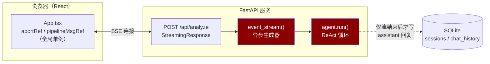
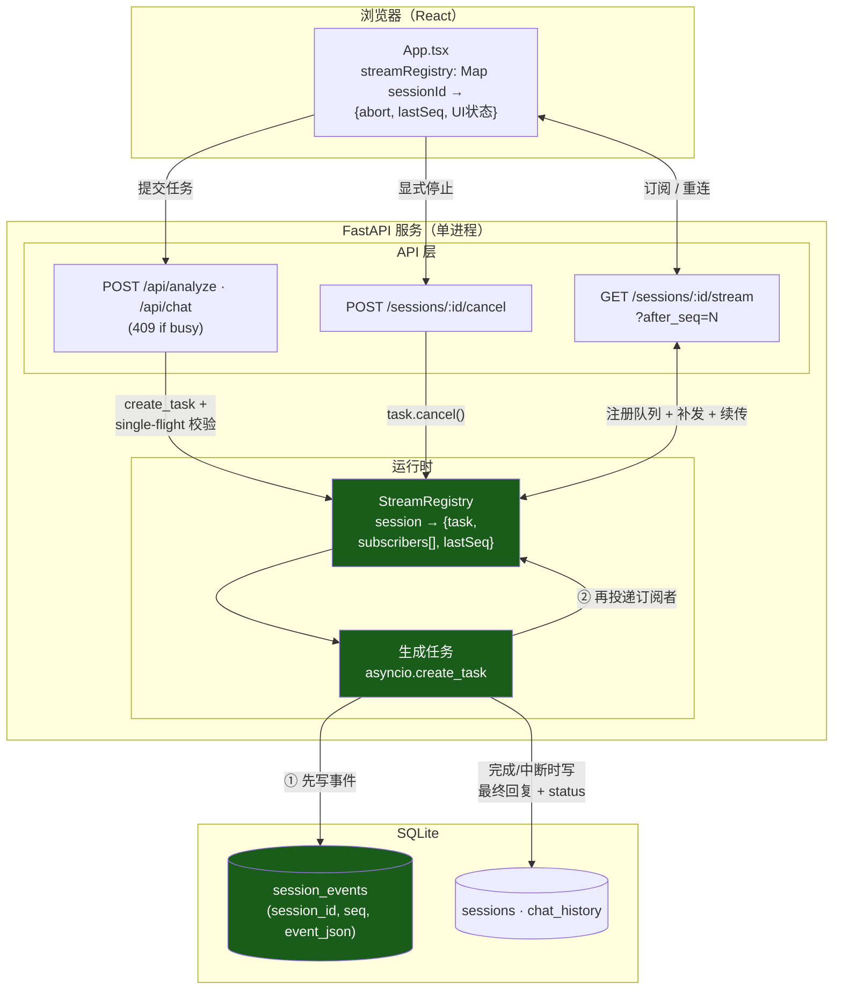
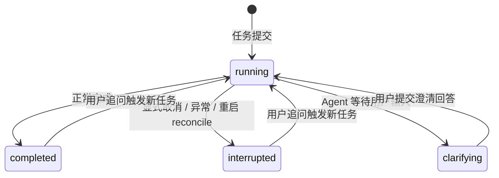
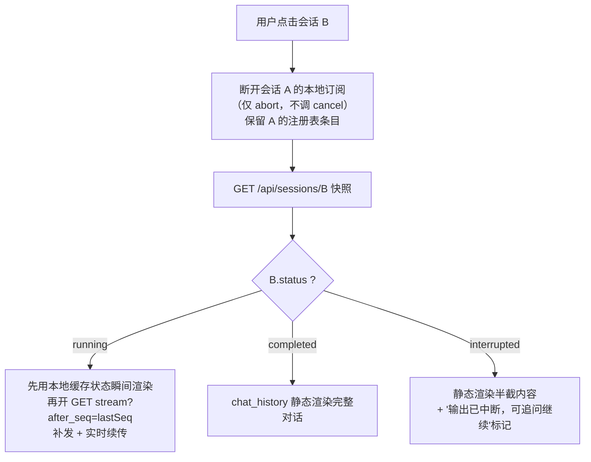

# 可恢复流式生成（Resumable Streaming）设计档案

| 项 | 值 |
| --- | --- |
| 文档状态 | 设计定稿，待实施 |
| 对应 change | `openspec/changes/resume-stream-on-session-switch` |
| 影响范围 | 后端 `api.py` / `agent_factory.py` / `session_store.py`（改造）+ `stream_registry.py`（新增）；前端 `App.tsx` / `types.ts` |
| 业界参照 | OpenAI Responses API `background` 模式、LangGraph Platform stream resumption、Vercel AI SDK `resumable-stream`、Ably channel resume |

---

## 1. 背景与问题定义

### 1.1 现象

深度分析/快速对话流式输出进行中，用户切换会话后再切回，输出永远停在切换时的位置，无法继续。coding agent 多次修复无效。

### 1.2 根因（三层）

**根因一：生成任务生命周期绑定 HTTP 连接。** `/api/analyze` 与 `/api/chat` 将 ReAct Agent 循环直接运行在 `StreamingResponse` 的异步生成器内（`api.py:1024`、`agent_factory.py:695`）。前端 `selectSession` 执行 `abortStreaming()`（`App.tsx:130`）断开 SSE 连接后，Starlette 的 `listen_for_disconnect` 收到 ASGI `http.disconnect`，向生成器协程注入 `asyncio.CancelledError`，Agent 循环级联终止。全项目不存在 `create_task` / `BackgroundTask` / `is_disconnected` / `CancelledError` 处理，即不存在"连接断开但任务继续"的任何机制。

**根因二：中断即丢数据、状态腐烂。** assistant 回复在流结束后才 `append_chat` 落库（`api.py:1067`、`api.py:1178`），中断时 collector 中已生成的部分内容随协程销毁；user 消息在请求开始时即落库（`api.py:903`），产生无回答的悬空 user 消息；session status 永远卡在 `running`/`clarifying`，无终态。

**根因三：spec 固化了错误行为。** `openspec/specs/frontend/spec.md` 的 `Session Selection` 与 `SSE Stream Abort Control` 明文规定"切换会话 SHALL 中断进行中的 SSE 流"，coding agent 按 spec 实现，每次修复都将错误行为重新引入。但 spec 只授权了前端"断开连接"的动作，对该动作的后端后果（终止生成、内容丢失）完全沉默——修复必须先补 spec 语义，再改代码。

### 1.3 问题定性

"断连即终止"并非实现 bug，而是前台流（foreground stream）的行业标准默认语义（OpenAI 同步流、LangGraph `on_disconnect="cancel"` 均如此）。本项目的正确定位是：**只实现了前台流，缺少"后台模式"层**。本设计即补齐该层。

---

## 2. 术语

| 术语 | 定义 |
| --- | --- |
| 可恢复流式生成（Resumable LLM Streaming） | 生成任务与传输连接解耦、连接断开后可重连并从断点继续接收输出的架构模式。业界亦称 Resumable Streams（Vercel）、Background Mode（OpenAI）、Stream Resumption/Rejoin（LangGraph） |
| 生成任务（task） | 以后台协程运行的 Agent 生成过程，持有者为 session 而非连接 |
| 事件日志（event journal） | `session_events` 表，按序持久化每个 SSE 事件的完整 JSON，是断线重放的唯一事实源 |
| seq | 会话内事件序号，从 1 单调递增；等价于 OpenAI `sequence_number`、SSE `Last-Event-ID` |
| cursor / after_seq | 客户端记录的最后已消费 seq，重连时凭它请求增量事件 |
| Registry | 进程内注册表，管理活跃任务句柄与实时订阅者 |
| 订阅者（subscriber） | 一条正在接收实时事件的 SSE 连接；断开 = 退订，不影响任务 |
| 终态事件 | `done` / `interrupted` / `error`，每个任务在日志中有且仅有一条 |

---

## 3. 设计原则

| # | 原则 | 违反后果 |
| --- | --- | --- |
| P1 | 生成是后台任务，连接只是订阅者；断开 = 退订，不是终止 | 回到本设计的原始 bug |
| P2 | 每个事件先写事件日志，再投递订阅者；重放只读日志，不依赖内存 | 崩溃窗口导致已确认事件永久丢失 |
| P3 | 恢复走独立 GET 端点：客户端凭 cursor 先补历史再接实时 | 无法断点续传，只能全量重拉或干等 |
| P4 | "断开"与"取消"语义分离；取消走专用幂等端点 | 重蹈 Vercel #8390：停止被误判为断连，任务被恢复 |
| P5 | 中断也有终态：部分输出落库、status=interrupted、日志追加终态事件；不留悬空 user 消息 | 状态腐烂、上下文污染 |

---

## 4. 总体架构

### 4.1 现状（故障架构）



### 4.2 目标架构



### 4.3 数据流全链路

```
Agent 产出事件
  → stream_agent_to_sse 映射为 SSE 字典
  → registry.publish(session_id, event)
      ① append_session_event() 写入 session_events（executor 线程池，获得 seq）
      ② put_nowait 到该会话所有订阅者队列（满则断开该订阅者）
  → 订阅端点从队列取出，格式化为 SSE 帧（含 id: seq）写出
  → 前端同一事件处理函数消费，按 seq 去重
```

---

## 5. 核心组件设计

### 5.1 StreamRegistry（新增 `src/finance_agent/stream_registry.py`）

进程内单例字典，回答三个问题：该会话有任务在跑吗？新事件发给谁？要停止时找谁？

```python
class SessionStream:
    task: asyncio.Task                 # 生成任务句柄（判活、取消用）
    subscribers: list[asyncio.Queue]   # 实时订阅者，每连接一个队列
    last_seq: int                      # 当前事件序号

class StreamRegistry:
    def __init__(self):
        self._streams: dict[str, SessionStream] = {}

    def start(self, session_id: str, coro) -> bool:
        """single-flight：已有活跃任务返回 False（上层转 409）。
        create_task 后必须持有强引用（防 GC），任务 finally 中 unregister。"""

    async def publish(self, session_id: str, event: dict) -> int:
        """先 append_session_event 落库取 seq，再 fan-out 到订阅者队列。
        队列有界（256），put_nowait 失败即移除该订阅者。"""

    def subscribe(self, session_id: str) -> asyncio.Queue:
        """注册实时队列，返回给订阅端点消费。"""

    def unsubscribe(self, session_id: str, queue) -> None: ...

    def cancel(self, session_id: str) -> bool:
        """task.cancel()；无活跃任务返回 False（上层转 404）。"""

    def unregister(self, session_id: str) -> None:
        """任务结束（完成/异常/取消）时必然调用，防泄漏导致的永久 409。"""
```

**约束**：进程内结构，限定单 uvicorn worker。多副本部署需替换为 Redis（pub/sub + stream），接口签名不变。

### 5.2 事件日志（`session_store.py` 扩展）

```sql
CREATE TABLE IF NOT EXISTS session_events (
    id         INTEGER PRIMARY KEY AUTOINCREMENT,
    session_id TEXT NOT NULL,
    seq        INTEGER NOT NULL,
    event_json TEXT NOT NULL,
    created_at TEXT NOT NULL,
    UNIQUE (session_id, seq)
);
CREATE INDEX IF NOT EXISTS idx_session_events_session
    ON session_events(session_id, seq);
```

新增函数：

- `append_session_event(session_id, event) -> seq`：会话内序号单调递增；SQLite 同步驱动经 `run_in_executor` 执行，避免阻塞事件循环；
- `list_session_events(session_id, after_seq) -> list[dict]`：重放查询，`WHERE seq > ? ORDER BY seq`；
- `delete_session` 级联删除该会话全部事件。

**与 chat_history 的分工**：`chat_history` 存已完成轮次的最终对话（LLM 上下文与历史回显），`session_events` 存流式过程的中间事件（仅服务断线重放）。任务完成时回复落 chat_history；事件日志在会话删除时清理。

### 5.3 生成任务封装（`api.py` 改造）

将 `event_stream`/`chat_stream` 的生成主体抽取为独立协程 `_run_generation(session_id, req, collector)`：

```python
async def _run_generation(session_id, req, collector):
    try:
        async for sse_dict in stream_agent_events(req, collector):
            await registry.publish(session_id, sse_dict)
        # 正常完成：回复落 chat_history、status 流转、publish done 终态
    except asyncio.CancelledError:
        # P5 中断兜底：半截回复落库（标注 [输出中断]，保留 thinking/tool_calls）
        # status=interrupted，publish interrupted 终态
        if collector.response.strip():
            append_chat(session_id, "assistant",
                        collector.response.strip() + "\n\n[输出中断]",
                        thinking=collector.thinking.strip() or None,
                        tool_calls=collector.tool_calls or None)
        update_session_status(session_id, "interrupted")
        await registry.publish(session_id, {"type": "interrupted", ...})
        raise   # CancelledError 必须 re-raise
    finally:
        registry.unregister(session_id)
```

`CancelledError` 处理三铁律：继承自 `BaseException`（`except Exception` 接不住）；catch 后必须 re-raise；兜底中的 await 需防二次取消（必要时 `asyncio.shield`）。

---

## 6. API 协议设计

```
POST /api/analyze · /api/chat             → 200 SSE（订阅流）/ 409 {"error":"session_busy"}
GET  /api/sessions/{id}/stream?after_seq=N → 200 SSE / 204（无活跃任务且无可重放事件）
POST /api/sessions/{id}/cancel            → 200 {"status":"interrupted"} / 404（无活跃任务）
DELETE /api/sessions/{id}                 → 删除前先 registry.cancel 活跃任务
```

协议细则：

1. **SSE 帧带序号**：`id: {seq}\ndata: {...}\n\n`，支撑原生 EventSource 的自动 `Last-Event-ID`；
2. **cursor 双通道**：`after_seq` 查询参数与 `Last-Event-ID` 头均接受，头优先（fetch 客户端手动传参数，EventSource 自动带头）；
3. **204 语义**：无活跃任务且无事件可重放时返回 204，客户端据此区分"无可恢复"与"恢复结束"；
4. **心跳**：每 5~10 秒下发 `: heartbeat\n\n` 注释行，防 Nginx/ALB/Cloudflare 空闲超时掐线，兼作半开 TCP 探测；
5. **响应头**：保留 `Cache-Control: no-cache`、`X-Accel-Buffering: no`（禁 Nginx 缓冲攒批）；
6. **single-flight**：活跃会话的新生成请求返回 409，且 SHALL NOT 追加 user 消息到 chat_history；
7. **取消幂等**：重复 cancel 返回相同终态而非报错（OpenAI 语义）；cancel 与任务自然完成竞态时，以事件日志中先落库的终态事件为准（终态写入做成 CAS：已有终态则拒绝）。

---

## 7. 状态机



- **启动 reconcile**：服务启动时执行 `UPDATE sessions SET status='interrupted' WHERE status='running'`——进程死亡残留运行态全部归位；
- **不变式**：任意时刻 chat_history 中不存在无 assistant 回复的悬空 user 消息（中断时半截回复也落库）；
- **终态唯一**：每个任务在事件日志中有且仅有一条终态事件（done/interrupted/error）。

---

## 8. 前端设计

### 8.1 流状态注册表

```typescript
const streamRegistry = new Map<string, {
  abort: AbortController   // 本会话订阅连接的控制器
  lastSeq: number          // 已消费的最大 seq
  pipelineMsg: UIMessage | null
  streamingReport: UIMessage | null
}>()
```

替代全局单例 `abortRef`/`pipelineMsgRef`/`streamingReportRef`。不同会话的流状态完全隔离。

### 8.2 selectSession 分流逻辑



| 切回时 status | 数据源 | 用户看到 |
| --- | --- | --- |
| running | 本地缓存 + 事件日志补发 + 实时队列 | 内容从切走位置继续增长 |
| completed | chat_history | 完整对话一次性静态呈现（不重播动画） |
| interrupted | chat_history（半截回复） | 半截内容 + 中断标记 |

### 8.3 其他交互

- **停止按钮**：调 `POST /sessions/{id}/cancel`；收到 interrupted 终态后结束流式状态；
- **运行中输入拦截**：当前会话 running 时提交新消息，前端先提示"该会话正在生成中，可停止后再发"（后端 409 为兜底）；
- **侧边栏运行指示**：status=running 或有活跃订阅的会话显示"生成中"标记，终态事件后移除；
- **beforeunload**：仅断开本地订阅连接，不调 cancel。

### 8.4 幂等消费

重放事件与实时事件必然有重叠（缝合段），两道防线：

1. **seq 去重**：事件处理前检查 `seq <= lastSeq` 则跳过（SSE 帧携带 `id:`）；
2. **状态迁移幂等**：`session_created` 对已激活会话 no-op；pipeline 消息 upsert（存在更新、不存在创建）；report 按序号拼接而非无脑 append。

重放/实时/首发事件**走同一处理函数**——禁止"重放模式/实时模式"两套分支逻辑。

---

## 9. 关键技术细节与陷阱

### 9.1 连接断开为何杀死生成（根因机制）

`StreamingResponse` 内部并行运行"迭代响应生成器"与"监听 http.disconnect"两个任务；客户端断开时取消整个任务组，在生成器当前挂起点（本项目中恰为 `async for event in agent.run(...)`）注入 `CancelledError`，沿调用栈向内级联引爆整个 ReAct 循环。TCP 半开连接无法即时感知，需靠下一次写失败或心跳发现。

### 9.2 先写日志再投递（崩溃窗口）

先投递后写库：崩溃时客户端已收到但库里没有 → 永久空洞。先写库后投递：最坏情况是重复投递，可用 seq 去重消解。宁 at-least-once + 去重，不 at-most-once + 丢数据（WAL 思想）。`UNIQUE(session_id, seq)` 是防重复写序号的最后防线。

### 9.3 重放缝合竞态

naive 实现"先读日志、再注册队列"会在两步之间丢失新到事件。正确顺序：**先注册实时队列，再读日志，按 seq 去重缝合**——重叠段事件两个通道都有，去重后不多不少。

### 9.4 背压

订阅者队列必须有界（256）。慢消费者（弱网客户端）队列满即被断开，凭 cursor 重连追平。服务端不为慢客户端承担存储成本；该策略成立的前提是事件日志作为完整副本存在（队列只是加速器）。

### 9.5 asyncio 任务管理

`create_task` 创建的任务若无强引用可能被 GC 回收——Registry 持有 task 句柄顺带解决。任务 finally 中必须注销 Registry 条目，否则残留死任务记录导致该会话永久 409。

### 9.6 终态竞态

cancel 与任务自然完成可能撞车。规则：日志中先落库的终态获胜，后到放弃。实现为"条件插入终态事件"（已有终态则拒绝），保证全局唯一终态，客户端永远以日志为准。

### 9.7 心跳的双重作用

① 防中间代理（Nginx/ALB/Cloudflare 约 100s 空闲超时）掐断长连接；② 主动写以探测半开 TCP，及时释放死连接资源。SSE 注释行（`: 开头`）客户端按协议忽略，零副作用。

---

## 10. 边界场景清单

| # | 场景 | 期望行为 |
| --- | --- | --- |
| 1 | 流式中切走再切回，任务仍 running | 从断点续传，不重复不遗漏 |
| 2 | 切走期间任务完成，切回 | 完整对话静态呈现，不开恢复流 |
| 3 | 显式停止后切回/刷新 | 半截内容 + 中断标记持久可见 |
| 4 | 服务重启后切回 running 会话 | reconcile 为 interrupted，重放存量 + 终态事件 |
| 5 | running 会话收到新消息 | 前端拦截提示 + 后端 409，user 消息不落库 |
| 6 | 双击/重试 cancel | 幂等返回终态，不报错 |
| 7 | cancel 与任务完成同时发生 | 日志先落库的终态获胜 |
| 8 | 慢网络订阅者 | 被断开，凭 cursor 追平；不影响任务与其他订阅者 |
| 9 | 删除运行中的会话 | 先 cancel 任务，再删除会话及其事件日志 |
| 10 | 重放含一次性事件（session_created/analysis_start） | 幂等处理，不产生重复 UI |

---

## 11. 非目标与部署约束

- 不引入分布式任务队列（Celery/Redis 等）；Registry 为进程内结构，**限定单 uvicorn worker**，部署文档须注明；
- 事件日志仅服务断线重放，不做完整事件溯源（event sourcing）改造；
- 不改动 LangGraph 5 层管线内部逻辑与 Langfuse 追踪结构；
- 多标签页/多设备同时在线的写冲突协调不在范围内（多订阅者只读转发天然支持，写操作受 single-flight 约束）。

---

## 12. 验收标准

1. 流式输出中途切会话/刷新/断网，任务继续；重连后内容从断点继续增长，不重复、不遗漏；
2. 中断后任务状态必然有终态（completed/interrupted），含进程重启场景，无 running 残留；
3. chat_history 无悬空 user 消息；半截回复落库并带中断标记；
4. running 会话拒绝新任务（409）；重复 cancel 幂等；cancel 与完成竞态以日志终态为准；
5. 重放的一次性事件不产生重复 UI；
6. 慢订阅者被断开且不影响生成与其他订阅者，可经 cursor 追平；
7. 修复 incident 012 的 2 个 SSE 映射 deselect 测试（registry 提供了可测试边界），移除 ci.yml 的 `--deselect`。

---

## 13. 测试矩阵

| 层 | 用例 |
| --- | --- |
| 单测（后端） | seq 单调性与唯一约束；级联删除；启动 reconcile；single-flight；断开不杀任务；慢订阅者断开；cancel 注销；after_seq 重放不多不少；Last-Event-ID 优先；无活跃任务终态事件 |
| 单测（前端） | 重放幂等（重复事件不产生重复 pipeline/报告段落）；per-session 状态隔离；运行指示生命周期；输入拦截 |
| E2E（stub 管线） | 中途切出再切回内容继续增长且无重复渲染；显式停止后中断标记刷新后仍在；运行中会话拒绝新输入 |

---

## 14. 分阶段实施

| 阶段 | 内容 | 对应 tasks.md |
| --- | --- | --- |
| Phase 0（止血） | 取消/异常时 finally 兜底落库半截回复 + status=interrupted + 启动 reconcile；架构不变 | 1.4、3.3 部分 |
| Phase 1（根治） | Registry + 事件日志 + 恢复端点 + 取消端点 + 前端 per-session 状态与重连 + E2E | 1~7 全部 |
| Phase 2（规模化，暂不做） | Redis 分层（流式缓冲 + 最终态落库）、多副本、多端 fan-out | — |

实施前置条件：**先合并 delta spec 对 `Session Selection` / `SSE Stream Abort Control` 的 MODIFIED**——拆除"切换 SHALL 中断流"的错误授权，代码改造才不会被 spec 拉回。

---

## 15. 业界实现对照

| 本设计 | OpenAI Responses API | LangGraph Platform | Vercel AI SDK | Ably |
| --- | --- | --- | --- | --- |
| 后台任务开关 | `background=true` | background run / `on_disconnect="continue"` | resumable-stream 包 | channel |
| 事件游标 | `sequence_number` | event id | stream offset | message offset |
| 恢复端点 | `GET /responses/{id}?stream=true&starting_after=N` | `GET .../runs/{id}/stream` + `Last-Event-ID` | `GET /api/chat/{id}/stream`（无活跃流 204） | channel resume |
| 断连语义 | 前台流断连即终止；后台模式断连继续 | cancel（默认）/ continue | abort 一律视为断连 | 连接与 channel 生命周期分离 |
| 取消 | `cancel` 端点（幂等） | `stream.stop()` ≠ `stream.disconnect()` | 专用 stop 端点 + 幂等守卫 | 独立取消信号 |
| 心跳 | — | 5s 注释行 | — | — |
| 事件存储 | 服务端（强制 store=true） | Postgres checkpoint | Redis（TTL 24h） | channel 持久化 |

**对照结论**：本设计骨架与三家公开实现同构（seq ≡ sequence_number、after_seq ≡ starting_after、cancel 端点 ≡ OpenAI cancel），单容器 SQLite 方案是其在单用户本地部署下的合理简化。已吸收的两个大厂教训：① resume 与 stop 必须在协议层区分（Vercel #8390 事故）；② per-token 持久化做分层，规模化时 Redis 缓冲 + 关系库终态。

---

## 16. 风险与开放问题

| 风险 | 等级 | 缓解 |
| --- | --- | --- |
| 重放导致 UI 重复渲染 | 中 | seq 去重 + 状态迁移幂等双防线；单测覆盖 |
| 进程重启被用户感知为故障 | 低 | reconcile + interrupted 终态事件 + 前端明确提示 |
| Registry 任务泄漏导致永久 409 | 中 | finally 必然注销 + cancel 逃生门 + 单测 |
| 事件日志体积增长 | 低 | 会话删除级联清理；report_ready 大 payload 单用户量级可控 |
| 单 worker 约束阻碍未来扩容 | 低 | Registry 接口已按可替换 Redis 设计；部署文档注明 |

**开放问题**：① 是否需要"已 interrupted 会话一键从断点重新生成"（当前需用户手动追问）；② 事件日志是否加 TTL 定期清理（当前仅级联删除）；③ 多标签页同时打开同一会话时的订阅优先级（当前行为：各自只读订阅，均可正常观看）。
