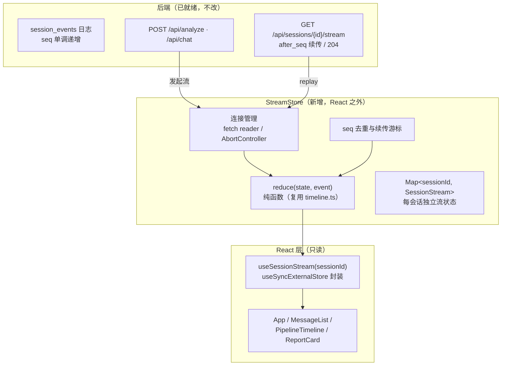
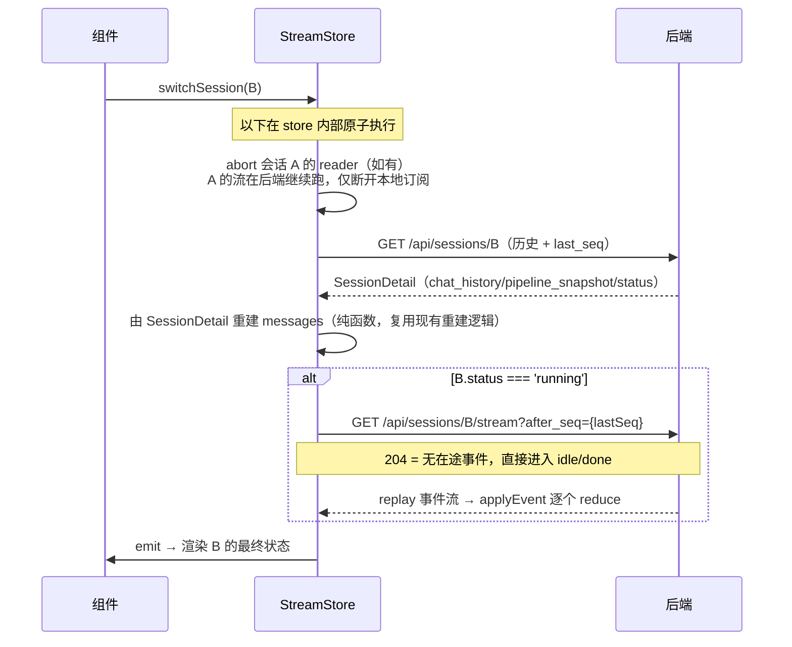
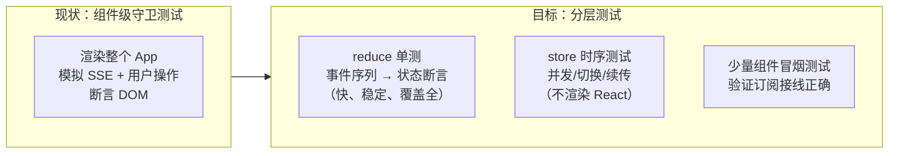

# 流状态层重构方案：StreamStore 设计与落地计划

> 项目：finance_analysis_agent / frontend
> 目标：消除前端流状态管理的架构性缺陷，对齐 DeerFlow 前端的状态所有权模式
> 状态：待评审 → 待实施
> 前置阅读：App.tsx（3518 行现状）、timeline.ts、types.ts、后端 api.py 恢复端点

---

## 1. 背景与问题陈述

### 1.1 症状

前端 UI bug 持续再生：已修复大量 bug（seq 竞态、stale guard、快照丢失等），但同族 bug 仍不断出现。`src/test/` 下 27 个测试文件中，至少 10 个在守护流式并发的时序正确性：

- `concurrent-subscription-seq-loss.test.ts`
- `select-session-stale-guard.test.ts`
- `followup-resume-after-switch.test.tsx`
- `followup-sse-dedup.test.tsx`
- `single-reader-invariant.test.ts`
- `streamingCursorLifecycle.test.ts`
- `session-created-ref-sync.test.ts`
- `restore-session-on-refresh.test.tsx`
- `multiline-list-stream.test.tsx`
- `stream-event-routing.test.tsx`

每修一个 bug 加一道守卫，守卫之间产生新的交互 bug——这是架构在持续生产 bug，不是修复速度问题。

### 1.2 根因：流状态所有权缺失

流状态（SSE 连接、事件缓冲、消息拼接、seq 游标、流归属）目前由 **App 组件亲自持有**，且同一事实存在三份拷贝：

| 拷贝 | 位置 | 角色 |
|---|---|---|
| React state | `messages`、`appState` 等 22 个 `useState` | 渲染用 |
| ref 镜像 | `messagesRef`、`currentSessionIdRef` 等 19 个 `useRef` | 闭包防旧值 |
| 手写注册表 | `streamRegistryRef: Map<sessionId, StreamState>` | 会话切换快照 |

三份拷贝靠 `commitMessages()` 手工同步，同步窗口即 bug 窗口。约 100 处 `setXxx` 散落在事件处理器中，任何处理器都能写任何状态——多写入者 × 异步时序交错 = 组合爆炸。

### 1.3 关键前提：后端事实源已就绪

本方案成立的前提是后端事件日志已落地（`resume-stream-on-session-switch` delta 已完成）：

- `session_events` 表：事件按 session 内单调递增 seq 落库，`UNIQUE(session_id, seq)`
- `append_session_event`：`BEGIN IMMEDIATE` 原子分配 seq（已修复并发竞态）
- 恢复端点 `GET /api/sessions/{id}/stream`：支持 `Last-Event-ID` / `?after_seq=N` 断点续传，204 语义
- `sessions.status`：running / completed / interrupted / failed 终态回执
- 启动 reconcile：残留 running 会话置 interrupted

**结论：前端 `streamRegistryRef` 里的 messages 快照层已从"必要"变成"冗余且有害"——两套事实源互相打架是残留 bug 的来源之一。本次重构的本质是让前端快照层退役，唯一事实源收敛到后端事件日志。**

---

## 2. 目标与非目标

### 2.1 目标

1. 流状态所有权从 App 组件迁移到独立的 `StreamStore`（单一写入者、单一事实源）
2. 组件对流状态只读订阅（`useSyncExternalStore`），删除全部 ref 镜像与手工同步代码
3. 会话切换 / 刷新恢复一律走后端 replay，前端不再保存消息快照
4. 状态变化逻辑收拢为 `reduce(state, event)` 纯函数，可脱离 React 单测

### 2.2 非目标（明确不做）

- ❌ 不迁移到 `@langchain/langgraph-sdk`（后端协议不兼容，改造成本失控）
- ❌ 不引入 XState 等状态机库（流式数据状态不是状态机的适用场景）
- ❌ 不改后端事件协议（已达标；gap 事件暂不需要，日志无 TTL 清理）
- ❌ 不重写 UI 组件（Sidebar / ReportCard / Charts / PipelineTimeline 保留）
- ❌ 不更换框架（保持 React 18 + Vite，不迁 Next.js）
- ❌ 本阶段不引入 React Query（列为后续独立迭代）

---

## 3. 与 DeerFlow 的差距对照

| 维度 | 现状（本项目） | DeerFlow | 本方案 |
|---|---|---|---|
| 流状态持有方 | App 组件 | langgraph-sdk `useStream` | 自研 `StreamStore` |
| 写入者 | 所有事件处理器（多） | 仅 SDK（单） | 仅 StreamStore（单） |
| 事实源 | 3 份拷贝 | 1 份快照 | 1 份（store 内部状态） |
| 状态更新范式 | 100 处命令式 setState | 纯函数派生 | `reduce` 纯函数 |
| 组件读取方式 | 直接读 state/ref | Context + `useThread()` 订阅 | `useSyncExternalStore` |
| 会话切换 | 命令式保存/恢复序列 | URL 驱动，SDK 响应 | store 内部协调 + 后端 replay |
| 切换/刷新恢复 | 前端快照兜底 | 后端 checkpoint | 后端 `after_seq` replay（已有） |
| 正确性守护 | 手写 guard 测试族 | SDK 测试套件 + 纯函数 | reduce 单测 + store 时序测试 |

DeerFlow 的模式不绑定 LangGraph 协议，本方案用约 300~400 行自研代码复制该模式骨架。

---

## 4. 目标架构



**数据流单向**：后端事件 → StreamStore（唯一写入）→ 快照 → React 订阅渲染。组件永远不能写流状态，只能通过 store 暴露的命令方法（`submit` / `switchSession` / `cancel`）表达意图。

---

## 5. 详细设计

### 5.1 状态模型

每个会话一份 `SessionStreamState`，字段从现有 `UIMessage` 体系直接映射：

```ts
// stores/streamStore/types.ts
import type { UIMessage, SSEEvent } from '../../types'

export type StreamPhase =
  | 'idle'         // 无活跃流
  | 'connecting'   // 已发起，等待首个事件
  | 'streaming'    // 流式接收中
  | 'awaiting_input' // 澄清等待（对应 awaiting_input 事件）
  | 'resuming'     // 切回/刷新后 replay 中
  | 'done'         // 正常完成（done / report_ready 后收口）
  | 'interrupted'  // 中断（interrupted 事件或后端 reconcile 状态）
  | 'error'        // 失败

export interface SessionStreamState {
  phase: StreamPhase
  messages: UIMessage[]        // 唯一事实源，替代现 messages + messagesRef + 快照
  lastSeq: number              // 已应用的最大 seq，去重与续传游标
  error?: string               // phase === 'error' 时的信息
}
```

要点：

- **不再为每会话缓存 `AbortController`**——连接生命周期见 5.4，同一时刻只允许一个活跃读取器（现有 `single-reader-invariant` 测试守护的规则，在 store 内变成结构保证）
- 不做跨会话的消息快照：非活跃会话的 `messages` 在切换时**丢弃**，切回时从后端重建（`GET /api/sessions/{id}` 拿历史 + `stream?after_seq=` 补在途事件）
- `phase` 取代现有 `appState` 中与会话相关的部分（'analyzing' / 'clarifying'）；全局 UI 状态（如侧边栏开关）不进 store

### 5.2 reduce 纯函数

```ts
// stores/streamStore/reduce.ts
export function reduce(
  state: SessionStreamState,
  event: SSEEvent,
): SessionStreamState
```

规则：

1. **纯函数**：不读外部变量、不发请求、不改 ref；相同输入必得相同输出
2. **seq 守门在函数外**（见 5.3）：reduce 假设收到的事件已通过去重，专注状态迁移
3. **复用现有纯函数资产**：`timeline.ts` 的 `applyChatStreamEvent`、`appendThinkingToken`、`closeAllThinking` 等直接作为 reduce 的内部步骤——它们已经是"事件 → 不可变更新"的形状

事件 → 状态迁移总表（基于 types.ts 现有 24 种事件）：

| 事件 | 迁移逻辑 | 复用 |
|---|---|---|
| `session_created` | 初始化/确认 sessionId 绑定（store 层处理，不进 reduce） | — |
| `parsing` / `resolved` / `stock_resolved` | 追加 system 消息或更新输入区状态 | 现有 banner 逻辑 |
| `analysis_start` | 创建 pipeline 消息（`type:'pipeline'`, `streaming:true`），phase→streaming | App.tsx 现有分支 |
| `node_start` / `node_complete` | 更新 pipeline 消息的 `layerTree` / `completedNodes` / `progress` | `pipelineTree.ts` |
| `node_timing` | 更新节点真实耗时字段 | 现有逻辑 |
| `thinking_token` / `thinking_replace` / `thinking_to_answer` | 更新 `agentTimeline` / `nodeTimelines` | `timeline.ts` 纯函数 |
| `tool_call` / `tool_result` | 追加/更新 `agentTimeline` 的 tool_call 条目 | `timeline.ts` |
| `search_start` / `search_result` / `search_error` | 更新 search 条目状态 | `timeline.ts` |
| `report_chunk` | 累加 report 消息 `reportMarkdown`，`streaming:true` | 现有逻辑 |
| `report_ready` | 报告消息定型（chartData/filePaths/webSources），phase 保持 streaming 等 done | 现有逻辑 |
| `chat_token` | 累加 chat 消息 `chatResponse` | 现有逻辑 |
| `chat_done` | `closeAllThinking`，chat 消息定型 | `timeline.ts` |
| `awaiting_input` | phase→awaiting_input，渲染澄清卡片所需字段入消息 | 现有逻辑 |
| `done` | phase→done，全部 streaming 标志收口 | 现有逻辑 |
| `interrupted` | phase→interrupted，保留部分产物 | 现有逻辑 |
| `error` | phase→error，追加 error 消息 | 现有逻辑 |

实施方式：把 App.tsx 中现有的事件处理 switch **逐分支搬运**进 reduce，每个分支搬运后立即跑对应现有测试验证行为等价。**这是重构的核心资产，也是工作量主体（估占 60%）。**

### 5.3 StreamStore 类

```ts
// stores/streamStore/index.ts
class StreamStore {
  private streams = new Map<string, SessionStreamState>()
  private listeners = new Set<() => void>()
  private activeReader: { sessionId: string; abort: AbortController } | null

  // ── React 订阅接口（useSyncExternalStore 契约）──
  subscribe = (fn: () => void): (() => void) => { /* 注册/反注册 */ }
  getSnapshot = (sessionId: string): SessionStreamState => {
    // 返回缓存的不可变状态对象；无状态时返回共享的 IDLE 常量（引用稳定）
  }

  // ── 命令方法（组件唯一可调用的写入口）──
  async submit(req: AnalyzeRequest | ChatRequest): Promise<void>
  switchSession(sessionId: string | null): void
  cancel(sessionId: string): Promise<void>

  // ── 内部（private，组件无权触及）──
  private async pump(sessionId: string, resp: Response): Promise<void>  // SSE 读取循环
  private applyEvent(sessionId: string, event: SSEEvent): void          // seq 守门 + reduce + 通知
  private async resume(sessionId: string): Promise<void>                // after_seq 续传 + 204 处理
  private emit(): void                                                  // listeners.forEach
}
```

**`applyEvent`——全部写入的唯一入口：**

```ts
private applyEvent(sessionId: string, event: SSEEvent): void {
  const prev = this.streams.get(sessionId) ?? IDLE_STATE

  // seq 守门：替代 followup-sse-dedup / concurrent-subscription-seq-loss 的守卫
  if (event.seq !== undefined) {
    if (event.seq <= prev.lastSeq) return            // 去重：过期事件丢弃
    // seq 空洞（event.seq > lastSeq + 1）不静默：
    // 标记需要 resync，触发 resume 补齐（见 5.5 风险 R2）
  }

  const next = reduce(prev, event)
  next.lastSeq = event.seq ?? prev.lastSeq
  this.streams.set(sessionId, next)
  this.emit()
}
```

**关键机制说明：**

1. **单读取器结构性保证**：`pump` 开始前，若 `activeReader` 存在且属于其他会话，先 abort 并等待其退出。`single-reader-invariant` 从"测试守护的约定"变成"不可能违反的结构"
2. **事件归属不再需要运行时判断**：现有 `streamingSessionIdRef` + `isCurrentViewEvent` 的存在理由是"旧会话的回调可能写当前视图"。store 中事件按 `sessionId` 写入对应 `SessionStreamState`，**迟到的事件写进它该去的会话，天然不会污染当前视图**——组件只渲染当前 sessionId 的快照
3. **不可变更新**：`reduce` 每次返回新对象，`getSnapshot` 返回引用稳定的快照——`useSyncExternalStore` 的正确性依赖这一点（同一事件不重复触发渲染）

### 5.4 React 集成

```ts
// stores/streamStore/useSessionStream.ts
export function useSessionStream(sessionId: string | null): SessionStreamState {
  const store = getStreamStore()  // 模块级单例
  const subscribe = useCallback(
    (fn: () => void) => store.subscribe(fn),
    [store],
  )
  const getSnapshot = useCallback(
    () => (sessionId ? store.getSnapshot(sessionId) : IDLE_STATE),
    [store, sessionId],
  )
  return useSyncExternalStore(subscribe, getSnapshot)
}
```

App 组件的终态形态（目标 < 800 行）：

```tsx
function App() {
  const [currentSessionId, setCurrentSessionId] = useState<string | null>(null)
  const stream = useSessionStream(currentSessionId)   // 只读

  // 派生渲染：纯函数，渲染期计算，零 setState
  const groups = useMemo(() => groupMessages(stream.messages), [stream.messages])

  // 用户意图 → store 命令
  const handleSubmit = (req) => getStreamStore().submit(req)
  const handleSelectSession = (id) => {
    setCurrentSessionId(id)
    getStreamStore().switchSession(id)
  }
  // ...渲染
}
```

**删除清单**（迁移完成的定义）：

| 删除对象 | 去向 |
|---|---|
| `streamRegistryRef` 及其 StreamState 类型 | 被 store 的 streams Map 取代（不含 messages 快照） |
| `commitMessages` | 不需要，reduce 不可变更新 |
| `messagesRef` / `currentSessionIdRef` / `streamingSessionIdRef` | 不需要，无闭包旧值问题 |
| `assistantMsgIdRef` / `pipelineMsgIdRef` / `pipelineMsgRef` / `streamingReportRef` | 消息定位逻辑进 reduce |
| `abortRef` / `pollStartRef` | 进 store 的 activeReader |
| `saveCurrentStreamState` / `getStreamState` / `resumeAfterSeqFromSnapshot` / `ensureSingleReader` / `msgIdToClearOnReaderExit` / `isCurrentViewEvent` / `shouldProcessFetchedSession` | 功能被 store 内部机制取代 |
| 3 处手写 `getReader()` 循环 | 收敛为 store 的 1 处 `pump` |

预期 `useRef` 从 19 个降到 ≤ 5 个（剩余的应服务于 DOM 引用、滚动等正当用途）。

### 5.5 会话切换协议

`switchSession(id)` 的内部序列（store 内一次同步调用完成，外部无法插入）：



与现状的本质差异：

- 现状：`selectSession` 是组件里的命令序列，中途任意时刻可能被 SSE 回调、effect、用户操作插入 → 需要 stale guard
- 目标：切换是 store 的一次方法调用，期间到达的事件进入**目标会话自己的 state**，通过 seq 自然排序；组件渲染的只是"当前 sessionId 此刻的快照"，不存在"切换途中"的脏视图

### 5.6 与后端协议对接清单

| 场景 | 前端行为 | 后端端点 |
|---|---|---|
| 新分析 / 追问 | `submit()` 发起 POST，response body 即 SSE 流交给 `pump` | `POST /api/analyze`、`POST /api/chat`（409 session_busy 语义不变） |
| 切回 running 会话 | `resume()` 带 `after_seq` | `GET /api/sessions/{id}/stream` |
| 页面刷新 | `sessionId` 从 localStorage 读出（现状保留）→ `switchSession` | 同上 |
| 会话列表 | 本阶段维持现有 `loadSessions`（React Query 化为后续迭代） | `GET /api/sessions` |
| 取消 | `cancel()` → POST cancel + 本地 abort | `POST /api/sessions/{id}/cancel` |

---

## 6. 迁移计划

原则：**每阶段独立可交付、可回滚；行为等价优先于结构优美。**

### Phase 0：复现与基线（0.5 天）

- [ ] 确认"双会话并发错乱"当前是否可复现（seq 竞态修复后）
- [ ] 现有 27 个测试全部跑绿，作为行为基线
- [ ] 整理 SSEEvent 24 种事件的实际出现顺序样本（从 Langfuse 或后端日志抓 3 次完整 run），作为 reduce 单测的 fixture

### Phase 1：reduce 纯函数（2~3 天，核心）

- [ ] 新建 `stores/streamStore/reduce.ts` 与 `types.ts`
- [ ] 逐事件分支从 App.tsx 搬运迁移逻辑，复用 `timeline.ts` 纯函数
- [ ] 每个分支搬运后跑对应现有测试（`timelineRenderer`、`agentTimeline`、`multiline-list-stream` 等）
- [ ] 产出：reduce 单测覆盖全部 24 种事件 + 典型事件序列 fixture 测试

回滚点：此阶段不动 App.tsx，纯新增文件，零风险。

### Phase 2：StreamStore 与连接层（2 天）

- [ ] 实现 `StreamStore`：subscribe/getSnapshot/applyEvent/pump/resume/submit/switchSession/cancel
- [ ] store 级时序测试（不渲染 React，直接驱动 store）：
  - 双会话并发流，事件交错到达 → 各自 state 正确（**替代 concurrent-subscription-seq-loss 的新形态**）
  - 流式中 switchSession → 切回 → 状态完整（替代 followup-resume-after-switch）
  - seq 乱序/重复到达 → 去重正确
  - resume 遇 204 → phase 正确收口
- [ ] 产出：store 单测套件（新增约 8~10 个测试）

### Phase 3：组件迁移（2~3 天）

- [ ] 实现 `useSessionStream` hook
- [ ] App.tsx 逐块切换：消息渲染 → pipeline 渲染 → 报告渲染 → 输入提交 → 会话切换
- [ ] 每块切换后跑全量测试；删除清单逐项核销
- [ ] 产出：App.tsx ≤ 800 行；ref ≤ 5 个；删除清单清空

### Phase 4：守卫测试核销与收尾（0.5~1 天）

- [ ] 逐一评估 10 个 guard 测试：守护的问题在结构上已不可能的 → 删除；仍有价值的 → 改写为 store 级测试（Phase 2 已覆盖大部分）
- [ ] 更新 OpenSpec / ADR（新增 ADR：前端流状态所有权外置）
- [ ] 事故记录文档更新：本次根因与结构性修复

**总工作量估算：7~9 天**（含测试），可按 Phase 独立停顿。

---

## 7. 测试策略变化



| 现有测试 | 处置 |
|---|---|
| `followup-sse-dedup` / `concurrent-subscription-seq-loss` | 逻辑进 applyEvent seq 守门 → 改写为 store 测试 |
| `select-session-stale-guard` / `select-session-last-seq` | 结构上不可能（切换原子化）→ 删除 |
| `followup-resume-after-switch` / `restore-session-on-refresh` | 改写为 store 的 resume 测试 |
| `single-reader-invariant` | 结构保证 → 删除（保留 1 个 store 测试证明 abort 旧 reader） |
| `session-created-ref-sync` | ref 已删 → 删除 |
| `streamingCursorLifecycle` | 游标进 store → 改写 |
| `timelineRenderer` / `agentTimeline` / `pipelineTree` / `eta` 等纯函数测试 | 保留不动 |
| 组件冒烟（smoke、SearchBanner 等） | 保留，必要时适配 hook |

净效果：测试总数基本持平，但**从"守时序组合的脆弱集成测试"变成"分层的确定性测试"**——这正是 DeerFlow 前端测试结构的形态。

---

## 8. 验收标准

1. **场景验收**（手动 + E2E）：
   - 双会话同时流式运行，快速来回切换 10 次 → 两会话内容各自完整，无串话、无丢字
   - 流式进行中刷新页面 → 恢复后从断点续传，无重复、无缺失
   - 流式进行中取消 → 立即停渲染，后端任务终止，会话状态 interrupted
   - 澄清流程：awaiting_input → 回答 → 继续分析，全程无异常
2. **代码指标**：
   - App.tsx ≤ 800 行；`useRef` ≤ 5；组件内 `getReader` = 0
   - 第 5.4 节删除清单全部核销
3. **测试**：全量测试通过；新增 reduce/store 测试覆盖率 ≥ 现有被删测试守护的场景

---

## 9. 风险与对策

| # | 风险 | 概率 | 对策 |
|---|---|---|---|
| R1 | reduce 搬运时行为漂移（某个分支遗漏隐式副作用） | 中 | Phase 0 fixture 先行；逐分支搬运 + 即时测试；搬完一块跑全量 |
| R2 | seq 空洞（后端跳号）在 replay 中暴露 | 低 | applyEvent 检测 `seq > lastSeq+1` 时不静默跳过：触发一次 `resume(after_seq=lastSeq)` 补齐；补齐失败降级为刷新会话详情 |
| R3 | 刷新恢复依赖 localStorage 的 sessionId，与后端 status 不一致 | 低 | switchSession 时以后端 SessionDetail.status 为准（interrupted/failed 直接定型，不发起 resume） |
| R4 | 高频 token 事件导致渲染压力 | 低 | store 内做微批（同一次事件循环的多个事件合并为一次 emit）；`useSyncExternalStore` 快照引用稳定避免无效渲染 |
| R5 | 重构期间新 bug 引入主分支 | 中 | 分支开发 + Phase 粒度 PR；CI 全量测试门禁（现有分支保护已配置） |

---

## 10. 后续迭代（本方案之外，单独排期）

1. React Query 接管 `loadSessions` / sessions 列表（删除 retry/preserve-on-error 守卫族）
2. `appState` 中剩余的 UI 模式状态收拢为 reducer（不需 XState）
3. session_id 进 URL（React Router 引入成本需单独评估，ROI 最低）
4. E2E：Playwright 补双会话并发场景（对齐 DeerFlow 的 e2e-real-backend 模式）

---

## 附：设计决策记录（供 ADR 引用）

| # | 决策 | 理由 |
|---|---|---|
| D1 | 自研 StreamStore 而非引入 langgraph-sdk | 后端协议为自定义 timeline 协议；SDK 绑定 LangGraph Server 协议，兼容层工程量失控 |
| D2 | `useSyncExternalStore` 而非 Context + useState | 官方为"React 外部可变源"设计的订阅 API；避免 tearing；快照引用稳定即可正确工作 |
| D3 | 事件按 sessionId 分流写入，而非全局判断"是否当前视图" | 归属判断从运行时检查变为数据结构保证，消除串话类 bug 的整个类别 |
| D4 | 前端不存消息快照，切回一律后端重建 + replay | 后端事件日志已是事实源；双事实源是残留 bug 来源 |
| D5 | seq 空洞显式 resync，不静默跳过 | 借鉴 DeerFlow gap 事件思想；静默降级是并发错乱"必然发生"的机制 |
| D6 | 逐分支搬运 + 行为等价验证，而非重写事件逻辑 | 现有事件处理包含大量已修 bug 的隐性知识，重写会丢失它们 |
