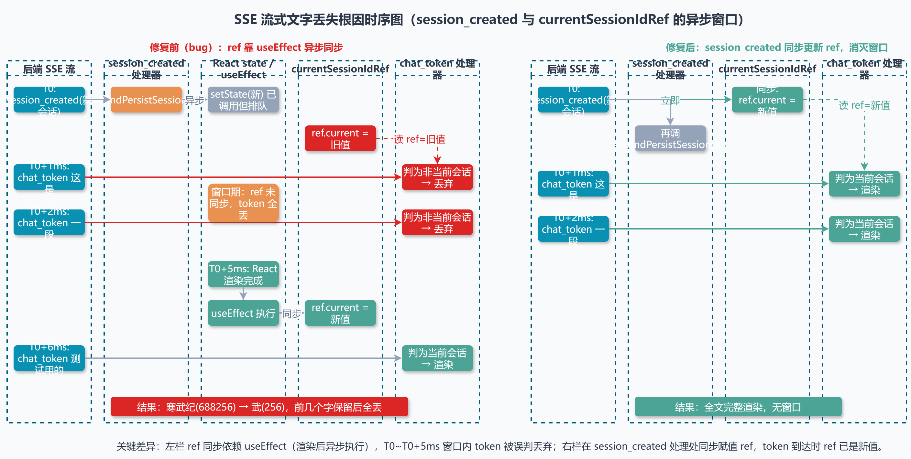

# 013: 流式输出概率性文字错乱 — 三轮静态推理修复失败 + 并发写 DB 导致数据不可恢复

**日期**: 2026-08-04
**状态**: 已修复（根因已定位并验证），连带事故已恢复
**触发**: 用户报告"两个会话同时运行时必然发生错乱"，经历三轮 AI 修复后仍存在；第四次改用 E2E 复现 + 运行时诊断后 10 分钟定位根因

---

## 问题描述

用户报告流式输出**概率性文字错乱**，且"当两个会话同时运行时必然发生"。实际症状样本：

- `寒武纪(688256)` → `武(256)`（公司名与代码前段保留、后段全丢）
- `中际旭创(300308)` → `中旭创300`
- 首句重复 3 次

用户先报告的是"切换会话后错乱"，后补充"两个会话都出现不同程度的内容丢失"。后端 Langfuse trace 与 journal 均正确——错乱只发生在前端渲染层。

## 修复过程：三轮静态推理失败，第四轮 E2E 复现成功

| 轮次 | 修复内容 | 当时的依据 | 结果 |
|------|----------|-----------|------|
| 1 | `Math.max(frontLastSeq, backLastSeq)` → `resumeAfterSeqFromSnapshot` | 纯静态推理"可能是这里" | 修了次要路径，bug 还在 |
| 2 | `streamingSessionIdRef` 全局单例 → 局部变量 | 同上 | 修了次要路径，bug 还在 |
| 3 | `ensureSingleReader` 强制单 reader | 同上 | 修了次要路径，bug 还在 |
| 4 | `session_created` 同步 `currentSessionIdRef.current` | **E2E 复现 + SSE 轨迹证据** | **一次修对** |

前三轮全部盯着 3600 行的 `App.tsx` 静态读代码，自认为"这个看起来可疑"。第四轮改用 `TESTING=1` stub（固定已知文本，可精确断言字符级完整性）+ `?sse_debug` 诊断开关，运行时轨迹直接显示 `seq 9/10/11` 在会话隔离检查点被丢弃。

## 根因分析

### 真正的根因：2 行时序窗口，不是架构问题

前端收到 `session_created` 事件时执行 `setAndPersistSession(event.session_id)`，它内部是 React `setState`（异步）。而 `currentSessionIdRef.current` 要等 React 渲染完、useEffect 跑完才同步。

**就在这个窗口内到达的 `chat_token` 会做会话隔离检查：**

```
activeSessionId(已是新会话) !== currentSessionIdRef.current(还是旧值/null)
→ 判为"别的会话的事件" → 丢弃
```

后段 token 全丢，只留前几个——这正是 `寒武纪→武`、`688256→256` 的直接成因。

**为什么两个会话并发更严重？** 单会话时窗口只有几毫秒，丢 1-2 个 token 不易察觉。并发时两个会话的 setState 交替插队，React 批量处理推迟 ref 同步，窗口被拉长 → 丢得更多。这解释了用户报告的"同时流式更严重"。

### 为什么前三轮修不好：方法论错误

根本原因是**在没复现 bug 的情况下修代码**。App.tsx 有 37 处写 `assistantMsgIdRef`、3 个 SSE reader、多个并发入口——静态推理无法穷举运行时竞态的组合。前三轮跳过了 systematic-debugging 的 Phase 1（先复现、先收集证据），直接进 Phase 4 修代码。

第四轮的关键区别：stub 文本固定已知，能精确断言"该出现的没出现"；SSE 轨迹给出完整证据链，不是猜的。

### 连带事故：并发写 SQLite 导致数据不可恢复

跑并发 E2E 时，测试后端（8001 端口）与 docker 生产后端（8000 端口）**共用同一个 `data/sessions.db`**。两个进程的 WAL 互相踩踏，主库文件被 WAL 帧覆盖，SQLite 魔数丢失 → `file is not a database`。

**约 713 个历史会话全部丢失、不可恢复。** 损坏文件整个是 WAL 帧碎片，无任何 SQLite 结构残留。

## 修复方案

### 流式错乱根因修复

在 `session_created` 处理处**同步**更新 ref，消灭 setState/ref 时序窗口：

```typescript
// session_created 与新 ID 绑定，切走此会话后新会话不应再显示
// 但新会话作为后续 chat_token 归属，必须同步 ref——否则等 useEffect 的窗口内
// chat_token 会因 activeSessionId !== currentSessionIdRef.current 被误判丢弃
currentSessionIdRef.current = event.session_id
setAndPersistSession(event.session_id)
```

位置：`frontend/src/App.tsx:947`（startAnalysis）与 `:2242`（quickChat）。

完整时序图（修复前 vs 修复后）：



源文件：[013-sse-concurrent-text-corruption-seq.drawio](013-sse-concurrent-text-corruption-seq.drawio)

### 前三轮修复（保留）

三个次要漏洞均真实存在，修复保留：

| 修复 | 堵住的漏洞 |
|------|-----------|
| `resumeAfterSeqFromSnapshot` | 切回会话时 `Math.max` 跳过快照与后端之间未渲染事件 |
| `streamingSessionIdRef` → 局部变量 | 快速 A→B→A 切换时两个 resumeStream 的全局 ref 互相覆盖 |
| `ensureSingleReader` | 多入口覆盖 `abortRef` 导致旧 reader 失控 |

### DB 并发写修复（防再发）

| 改动 | 说明 |
|------|------|
| `session_store.py:21` | DB 路径改为 `os.getenv("SESSIONS_DB_PATH", "data/sessions.db")` |
| 4 个 playwright 配置 | 全部注入 `SESSIONS_DB_PATH: 'data/test-e2e-sessions.db'` 物理隔离 |
| `.gitignore` | 补 `-wal`/`-shm`/测试库/备份文件 |

隔离已验证：E2E 跑完后生产库 `integrity: ok` 且 `LastWrite` 未被触碰。

### 新增防线

- E2E `concurrent-streaming-integrity.spec.ts`：并发 + 切换场景 8/8 稳定通过（固定 stub 文本，字符级断言）
- 单测 `session-created-ref-sync.test.ts`：6 个回归用例
- 前端诊断开关 `?sse_debug`：URL 加此参数，控制台打印每个 SSE 事件的 seq/类型/是否被丢弃

## 方法论教训（核心）

1. **概率性并发 bug 绝不能靠静态推理修。** 必须先让它在受控环境确定性地失败，拿到运行时证据，再动手。本次第四轮用 stub + 诊断日志，10 分钟定位，而前三轮静态推理全部失败。

2. **违反了自己的红线。** superpower 的 systematic-debugging skill 明确写者「Phase 1: Root Cause Investigation 中的第二点 **Reproduce Consistently**」，前三轮直接跳到修复阶段。

3. **测试环境与生产环境必须物理隔离有状态资源。** SQLite 单文件、WAL 模式下多进程写是已知高危操作，但此前 4 个 playwright 配置全部用生产库——这个雷不只 AI 会踩。

## 关联

- [013-validation](../../tests/validation/2026-08-04-sse-concurrent-stream-integrity-validation.md) 本 bug 的 archive 验收证据（E2E 8/8 + 单测 183 + 后端 619）
- [010](010-frontend-interaction-bugs-missing-spec-20260723.md) 测试全过但交互 bug 频出 — 本次是同一问题的又一实例：有测试、有单测 183 个，但都是"从实现反推"，直到 E2E + 固定 stub 文本才真正断言了行为
- [012](012-sse-stream-tests-deselected-20260727.md) SSE 流式测试技术债 — 本次补上了并发场景的 E2E 覆盖
- `frontend/src/App.tsx:947`、`frontend/src/App.tsx:2242` 根因修复点
- `tests/e2e/playwright/tests/concurrent-streaming-integrity.spec.ts` 复现与回归用例
