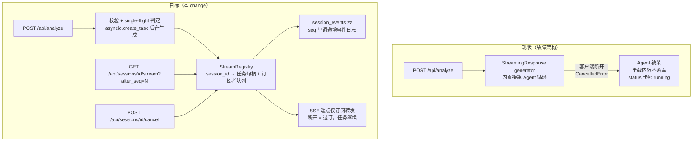
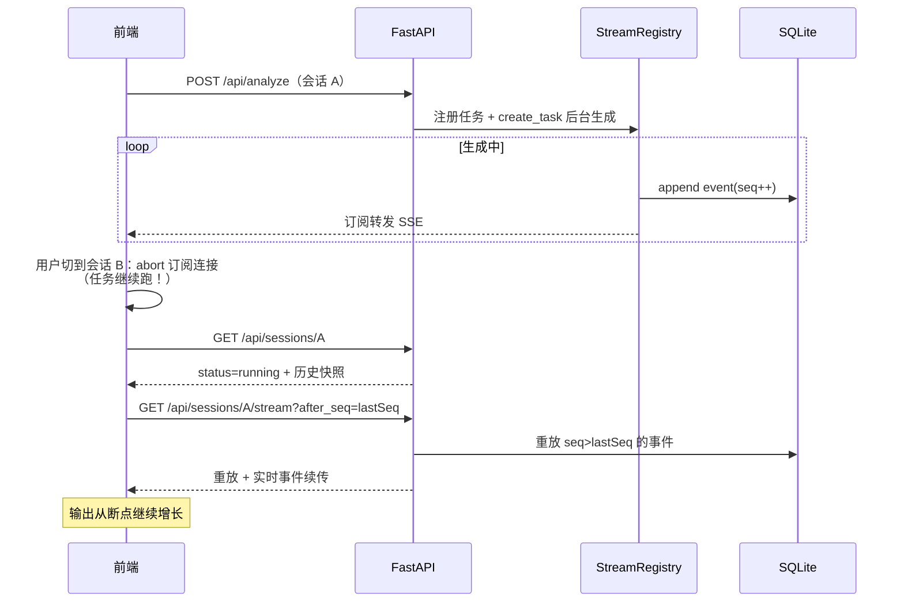

# Design: resume-stream-on-session-switch

## 架构对比



## 关键决策

### D1：进程内 Registry 而非外部队列

`StreamRegistry` 用进程内 `dict[session_id, SessionStream]` 实现（任务句柄、`list[asyncio.Queue]` 订阅者、当前 seq）。理由：项目为单容器 Docker Compose 部署，引入 Redis 等外部依赖不成比例。**代价**：限定单 uvicorn worker；服务重启即任务死亡，由启动 reconcile（残留 `running` → `interrupted`）兜底，重连端点重放 journal 后下发终态 `interrupted` 事件，前端可追问继续。

### D2：Journal 是事实源，Queue 只做实时分发

每个事件先写 `session_events`（同步 SQLite 写入放在 executor，避免阻塞事件循环），再 fan-out 到订阅者队列。重放只读 journal，不依赖内存——重启后历史事件仍可重放。队列有界（如 256），订阅者消费过慢则断开该订阅者（前端可靠 `after_seq` 重连追平），不允许反压拖垮生成任务。

### D3：中断的持久化语义

后台任务捕获 `CancelledError`/异常时，在 `finally` 中：collector 有部分回复 → 落库 assistant 消息（内容末尾追加 `[输出中断]` 标记，保留 thinking/tool_calls）；status → `interrupted`；journal 追加 `{"type":"interrupted"}` 终态事件。**不吞 CancelledError，处理后 re-raise**。悬空 user 消息问题由此消解：中断场景下 assistant 侧必然有一条（可能是半截的）回复记录。

### D4：Single-flight 与取消

- 同一 session 存在活跃任务时，`/api/analyze`、`/api/chat` 返回 409 `{"error":"session_busy"}`；前端提示"该会话正在生成中，可停止后再发"。
- `POST /api/sessions/{id}/cancel`：registry 找到任务句柄 `task.cancel()`，走 D3 的中断落库路径。前端"停止"按钮调此端点，而非本地 abort（本地 abort 只断自己的订阅，杀不掉后台任务）。
- `abortStreaming()` 从前端主流程移除，仅在 `beforeunload`/组件卸载时用于断开订阅连接。

### D5：前端重连协议

`selectSession` 选中会话后：`GET /api/sessions/{id}` 拿快照；若 `status == 'running'` → 开 `GET /api/sessions/{id}/stream`（浏览器 EventSource 自动带 `Last-Event-ID`；fetch 实现则手动记 lastSeq 拼 `after_seq`），事件按既有 `handleSSEEvent`/`handleChatStreamEvent` 路径消费——**重放事件与实时事件走同一处理函数，保证 UI 幂等重建**。`streamRegistry: Map<sessionId, {abort: AbortController, pipelineMsg, streamingReport, lastSeq}>` 替代全局单例 ref；切出会话时仅 abort 自己的订阅连接并保留 Map 中已累积状态，切回时先用本地状态渲染、再追平增量。

### D6：事件幂等性

重放会重复投递 `session_created`/`analysis_start` 等一次性事件，前端处理函数必须幂等：pipeline 消息以"当前会话流状态是否已存在 pipeline"判定而非无脑 push；`session_created` 对已激活会话为 no-op。后端同理：`report_ready` 的 session 元数据注入改为任务侧完成，避免订阅路径重复改写。

## 数据迁移

```sql
CREATE TABLE IF NOT EXISTS session_events (
    id          INTEGER PRIMARY KEY AUTOINCREMENT,
    session_id  TEXT NOT NULL,
    seq         INTEGER NOT NULL,
    event_json  TEXT NOT NULL,
    created_at  TEXT NOT NULL,
    UNIQUE (session_id, seq)
);
CREATE INDEX IF NOT EXISTS idx_session_events_session ON session_events(session_id, seq);
```

status 枚举新增 `interrupted`（SQLite TEXT 无枚举约束，仅应用层约定）；`init_db()` 启动时执行 `UPDATE sessions SET status='interrupted' WHERE status='running'`（reconcile）。事件清理策略：会话删除时级联删除其 events；暂不做过期回收（单用户本地部署量级可控）。

## 时序：切换会话再切回



## 风险与缓解

| 风险 | 缓解 |
| --- | --- |
| 重放事件导致 UI 重复渲染（pipeline 卡片、session_created） | D6 幂等要求写入 spec 场景；单测覆盖 |
| 重启后任务丢失被用户感知为"又断了" | journal 重放 + `interrupted` 终态事件 + 前端"已中断，可追问继续"提示 |
| 订阅者慢消费反压 | 有界队列 + 断开慢订阅者（D2），不阻塞生成 |
| single-flight 误锁（任务泄漏未清理） | 任务 `finally` 中必然注销 registry；cancel 端点提供逃生门 |
| `report_ready` 大 payload 重复落库撑大 journal | journal 存完整事件；会话删除级联清理；量级可接受，不做压缩 |
